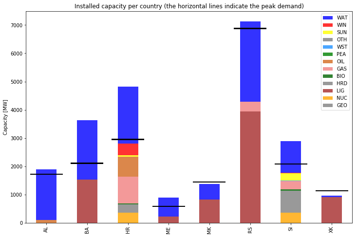
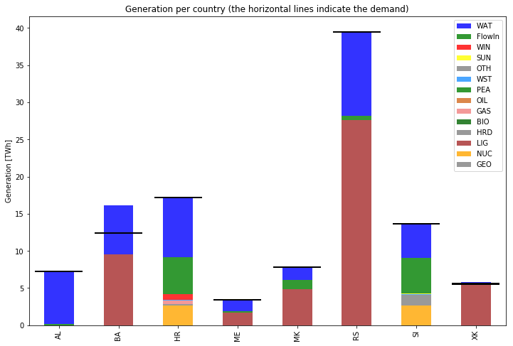

.. _casebalkans:

Dispa-SET for the Balkans region
================================

Description
-----------
This is input data of the Dispa-SET model, applied to the Balkans Region

Countries included in different scenarios are show in the table [1]_ [2]_ [3]_ [4]_ :

+-----------+------+------+------+------+
| Countries | 2010 | 2015 | 2020 | 2030 |
+===========+======+======+======+======+
|Albania    | [O]  | [O]  | [O]  | [O]  |
+-----------+------+------+------+------+
|Bosnia and | [O]  | [O]  | [O]  | [O]  |
|Herzegovina|      |      |      |      |
+-----------+------+------+------+------+
|Croatia    | [X]  | [O]  | [O]  | [O]  |
+-----------+------+------+------+------+
|Kosovo     | [O]  | [O]  | [O]  | [O]  |
+-----------+------+------+------+------+
|Macedonia  | [O]  | [O]  | [O]  | [O]  |
+-----------+------+------+------+------+
|Montenegro | [O]  | [O]  | [O]  | [O]  |
+-----------+------+------+------+------+
|Serbia     | [O]  | [O]  | [O]  | [O]  |
+-----------+------+------+------+------+
|Slovenia   | [X]  | [O]  | [O]  | [O]  |
+-----------+------+------+------+------+

The model has the ability to describe every single unit, or a cluster of units powered by the same fuel type and technology, with a high level of detail can be modelled together with a large number of RES units with separate hourly distribution curves.
 
Features
--------

The model is expressed as an optimization problem. Continuous variables include the individual unit dispatched power, the shedded load and the curtailed power generation. The binary variables are the commitment status of each unit. The main model features can be summarized as follows:

- Minimum and maximum power for each unit
- Power plant ramping limits
- Reserves up and down
- Minimum up/down times
- Load Shedding
- Curtailment
- Pumped-hydro storage
- Non-dispatchable units (e.g. wind turbines, run-of-river, etc.)
- Start-up, ramping and no-load costs
- Multi-nodes with capacity constraints on the lines (congestion)
- Constraints on the targets for renewables and/or CO2 emissions
- Yearly schedules for the outages (forced and planned) of each units
- CHP power plants and thermal storage

The demand is assumed to be inelastic to the price signal. The MILP objective function is therefore the total generation cost over the optimization period. 

Quick start
-----------

If you want to download the latest version from github for use or development purposes, make sure that you have git and the [anaconda distribution](https://www.continuum.io/downloads) installed and type the following::

	git clone https://github.com/energy-modelling-toolkit/Dispa-SET.git
	cd Dispa-SET
	conda env create  # Automatically creates environment based on environment.yml
	source activate dispaset # in Windows: activate dispaset
	pip install -e . # Install editable local version

The above commands create a dedicated environment so that your anconda configuration remains clean from the required dependencies installed.

To check that everything runs fine, you can build and run a test case by typing::

	dispaset -c ConfigFiles/ConfigTest.xlsx build simulate

Make sure that the path is changed to local Dispa-SET folder in folowing scripts (the procedure is provided in the scripts)::

	build_and_run.py
	read_results.py

  
Documentation
-------------
The general documentation of the Dispa-SET model and the stable releases are available on the main Dispa-SET website: http://www.dispaset.eu

Licence
-------
Dispa-SET is a free software licensed under the “European Union Public Licence" EUPL v1.2. It can be redistributed and/or modified under the terms of this license.

Important results
-----------------

Main developpers
----------------
- Matija Pavičević (KU Leuven) - gathered and analysed the data, performed the computations, analysed and verified the results
- Sylvain Quoilin (University of Liège, KU Leuven) -  designed the model and the computational framework, verified the results 
- Andreas Zucker (Joint Research Centre, European Commission) - supervised the whole process

References
----------
More details regarding the model and its implementation are available in the following publications

.. [1] Pavičević, M., Kavvadias, K. & Quoilin, S. (2018). Impact of model formulation on power system simulations - Example with the Dispa-SET Balkans model, EMP-E conference 2018: Modelling Clean Energy Pathways, Brussels.
.. [2] Pavičević, M., Quoilin, S. & Pukšec, T., (2018). Comparison of Different Power Plant Clustering Approaches for Modeling Future Power Systems, Proceedings of the 3rd SEE SDEWES Conference, Novi Sad.
.. [3] Tomić, I., Pavičević, M., Quoilin, S., Zucker, A., Pukšec, T., Krajačić. G. & Duić, N., (2017). Applying the Dispa-SET model on the seven countries from the South East Europe. 8th Energy Planning and Modeling of Energy Systems-Meeting, Belgrade. https://bib.irb.hr/prikazi-rad?rad=901595
.. [4] Pavičević, M., Tomić, I., Quoilin, S., Zucker, A., Pukšec, T., Krajačić. G. & Duić, N., (2017). Applying the Dispa-SET model on the Western Balkans power systems. Proceedings of the 2017 12th SDEWES Conference, Dubrovnik. http://hdl.handle.net/2268/215095

Other contributors
------------------
- Ivan Tomić (University of Zagreb) - gathered and analysed the initial data
- Tomislav Pukšec (University of Zagreb) - analysed the inital results
- Goran Krajačić (University of Zagreb) - supervised inital project
- Neven Duić (University of Zagreb) - supervised inital project 

.. _Balkans: https://github.com/balkans-energy-modelling/DispaSET-for-the-Balkans

