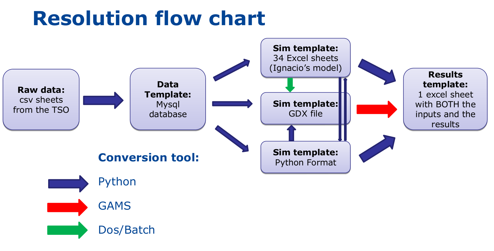

.. _data:

Data Schema
===========
Description of data I/O

Dispa-SET is using both GDX and excel spreadsheets ....

Resolution Flow Chart
---------------------

Raw data processing:

- Read csv sheets, assemble data
- Convert to the right format (timestep, units, etc).
- Define proper time index (duplicates not allowed)
- Connect to database
- Check if data present & write data
- Write metadata

Writing the DispaSET template:

- Slice the data to the required time range
- Deal with missing data
- Check data for consistency (min up/down times, startup times, etc.
- Calculate variable cost for each unit
- Clustering
- Define scenario according to user inputs (curtailment, participation to reserve, amount of VRE, amount of storage, …)
- Define initial state (basic merit-order dispatch)
- Write simulation environment to folder

Simulation environment and interoperability:

- Self-consistent folder with all what is needed for a simulation:
	- Excel files
	- GDX file
	- Gams model files
- Python files
- Possibility to modify the template manually and re-generate GDX file in DOS or in Python
- Batch (DOS) script is automatically generated by python for all variables

Simulation:

- The GAMS simulation file must be run from the created simulation folder
- All results and inputs are written to an excel file
- The DispaSET model can also be run in Python, using Pyomo and CPLEX (seems faster than GAMS, to be confirmed)

Power plant clustering
---------------------- 

.. image:: figures/clustering.png

