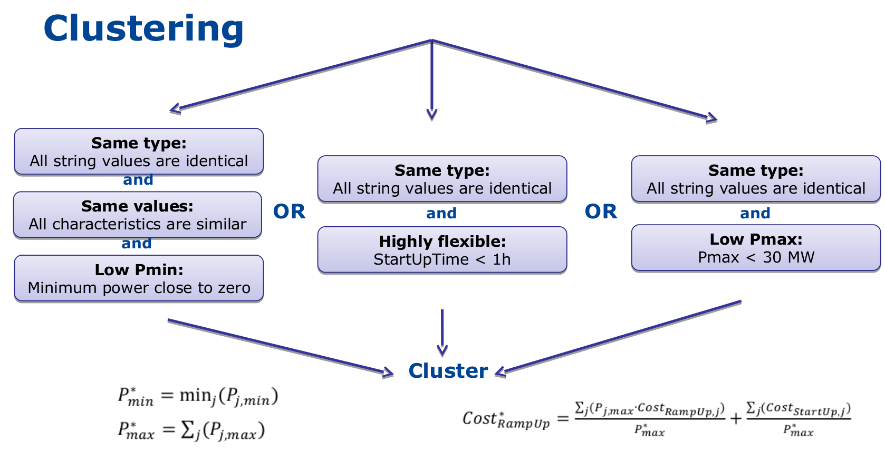

.. _formulations:

Model Formulations
==================

Because of the constraints linked to computational efficiency and to data availability, it is not necessarily desirable to accurately model each individual unit in the power system. For that reason, Dispa-SET can operate under different modelling hypotheses and levels of complexity. In terms of formulation of the optimization problem, these include for example:

* A linear programming formulation, in which all units are clustered by technology
* An integer formulation in which a typical unit is considered for each technology and multiplied N times. The formulation allows taking into account constraints such as minimum up/down times, minimum load, etc.
* A binary formulation in which each power plant in the system is considered individually

The section describes the various clustering options and modeling formulations available in Dispa-SET. It is worthwhile to note that each clustering method and/or modelling formulation can be applied to the same reference dataset. This allows comparing the various methods in terms of computational efficiency, but also in terms of accuracy.

Four main formulations are currently available:

No clustering
^^^^^^^^^^^^^
In this case, the pre-processing tool does not modify the power plant input data. The user is allowed to cluster some power plants himself by defining the Nunits input variable in the power plants input csv file. Let us consider the following (incomplete) inputs as an example:

.. table:: 

	=============== =============== ======= ======= =============== =====
	Unit	        PowerCapacity   Nunits  Zone    Technology   	Fuel
	=============== =============== ======= ======= =============== =====
	Maasvlakte	500		1	Z2	STUR		HRD
	Diemen		430		1	Z2	COMC		GAS
	CCGTs		400		6	Z2	COMC		GAS
	Borssele	408		1	Z2	STUR		HRD
	OCGT1		25		1	Z2	GTUR		GAS
	TIHANGE 3	1000		1	Z1	STUR		NUC
	DROGENBOS TGV	465		1	Z1	COMC		GAS
	SISTERON	214		2	Z1	HDAM		WAT
	SIERREUX	20		1	Z1	GTUR		GAS
	ANGLEUR		30		1	Z1	GTUR		GAS
	WindOn_Z1	200		1	Z1	WTON		WIN
	=============== =============== ======= ======= =============== =====

In this example, there are a number of different unit types and two zones. Some power plants have Nunits=1, which implies that they will be considered individually in the optimization. Other power plants (CCGTS and SISTERON) are multiplied 6 and 2 times, respectively. This implies that the total capacity of CCGTs and SISTERON units is 2400 MW and 228 MW, respectively. Note that all unit characteristics in the input data (not appearing in the above table) should be defined for a single unit!

These two units are assigned an integer variable instead of a binary variable in the optimization. The solver successively starts 1, 2, 3, 4, etc. units with the exact same characteristics. In this approach, start-up costs, minimum up and down times, minimum part-load are considered, but with a significantly improved computational efficiency. The loss in accuracy resides in the hypothesis of identical characteritics for all units in a clustered group. This is however acceptable if not data is available at the individual power plant level, or if the complexity of the modeled system does not justify such a high disaggregation level.

Standard formulation
^^^^^^^^^^^^^^^^^^^^
For computational efficiency reasons, it is useful to merge some of the original units into larger units. This reduces the number of continuous and binary variables and can, in some conditions, be performed without significant loss of simulation accuracy.

In the standard formulation (formerly call MILP formulation), the units that are either very small or very flexible are merged into larger units. Some of these units (e.g. the turbojets) indeed present a low capacity or a high flexibility: their output power does not exceed a few MW and/or they can reach full power in less than 15 minutes (i.e. less than the simulation time step). For these units, a unit commitment model with a time step of 1 hour is unnecessary and computationally inefficient. They are therefore merged into one single, highly flexible unit with averaged characteristics.

The condition for the merging of two units is a combination of subconditions regarding their type, maximum power, flexiblity and technical similarities. They are summarized in the figure below (NB: the thresholds are for indicative purpose only, they can be user-defined).

When two units are merged, the minimum and maximum capacities of new aggregated units (indicated by the star) are given by:

.. math::

	P_{min}^* = min(P_{j,min})

.. math::

	P_{max}^* = \sum_j (P_{j,min})

The last equation is also applied for the storage capacity or for the storage charging power.

The unit marginal (or variable cost) is given by:

.. math::

	Cost_{Variable}^* = \frac{\sum_j ( P_{j,max} \cdot Cost_{Variable,j} )}{P_{max}^*}

The start-up/shut-down costs are transformed into ramping costs (example with ramp-up):

.. math::

	Cost_{RampUp}^* = \frac{\sum_j ( P_{j,max} \cdot Cost_{RampUp,j} )}{P_{max}^*} + \frac{\sum_j ( Cost_{StartUp,j} )}{P_{max}^*}

Other characteristics, such as the plant efficiency, the minimum up/down times or the CO2 emissions are computed as a weighted averaged: 

.. math::

	Efficiency^* = \frac{\sum_j ( P_{j,max} \cdot Efficiency_{j} )}{P_{max}^*}

It should be noted that only very similar units are merged (i.e. their quantitative characteristics should be similar), which avoids errors due to excessive aggregation. 

In the example provided in the above table the following would occur:

- SIERREUR and ANGLEUR would be merged because they are small and highly flexible. 
- OCGT1 cannot be merged with SIERREUX and ANGLEUR since they don't belong to the same zone. 
- Maasvlakte and Borssele are not merged, although they have the same technology, fuel and zone. This is because their size is significant and they flexibility is low.
- Diemen and CCGTS are merged only if their flexibility is high (i.e. they can start/stop or ramp to full load in less then one hour).

Integer clustering
^^^^^^^^^^^^^^^^^^
In this formulation, all units of a similar technology, fuel and zone are clustered: a typical unit is defined by averaging the characteristics of all units belonging to the cluster. The total number of units is conserved, allowing a proper representation of constraints such as start-up costs, minimum up/down times or minimum stable load values. In the example provided above, the integer clustering would results into the following unit list:

.. table:: 

	=============== =============== ======= ======= =============== =====
	Unit	        PowerCapacity   Nunits  Zone    Technology   	Fuel
	=============== =============== ======= ======= =============== =====
	Z2_STUR_HRD	454		2	Z2	STUR		HRD
	Z2_COMC_GAS	404		7	Z2	COMC		GAS
	OCGT1		25		1	Z2	GTUR		GAS
	TIHANGE 3	1000		1	Z1	STUR		NUC
	DROGENBOS TGV	465		1	Z1	COMC		GAS
	SISTERON	214		2	Z1	HDAM		WAT
	Z1_GTUR_GAZ	25		2	Z1	GTUR		GAS
	WindOn_Z1	200		1	Z1	WTON		WIN
	=============== =============== ======= ======= =============== =====

where the total capacity and number of units for each technology/fuel is conserved. More details regarding the formulation and the implementation of the integer clustering are available in [1]_

LP clustering
^^^^^^^^^^^^^
Dispa-SET provides the possibility to generate the optimisation model as an LP problem (i.e. withtout the binary variables). In that case, the following constraints are removed since they can only be expressed in an MILP formulation: 

* Minimum up and down times
* Start-up costs
* Minimum stable load

Since the start-up of individual units is not considered anymore, it is not useful to disaggrate them in the optimisation. All units of a similar technology, fuel and zone are merged into a single unit using the equations proposed in the previous sections.
This formulation is used in the :ref:`mid_term` .

.. [1] Incorporating Operational Flexibility Into Electric Generation Planning: Impacts and Methods for System Design and Policy Analysis, Palmintier, B.S. (2012). Ph.D. Thesis, Engineering Systems Division, MIT

