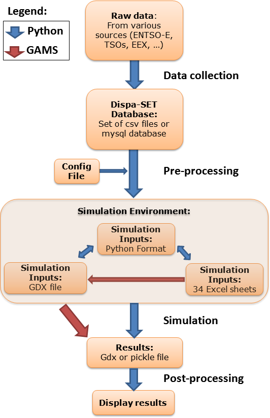
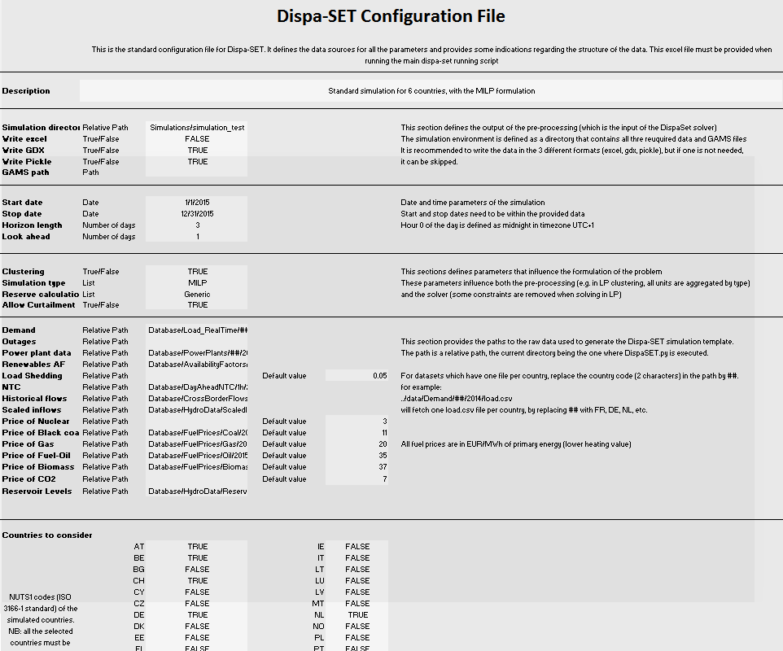

.. _implementation:

Implementation and interface
============================

The typical step-by-step procedure to parametrize and run a DispaSET simulation is the following:

1. Fill the Dispa-SET database with properly formatted data (time series, power plant data, etc.)
2. Configure the simulation parameters (rolling horizon, data slicing) in the configuration file.
3. Generate the simulation environment which comprises the inputs of the optimisation
4. Open the GAMS simulation files (project: UCM.gpr and model: UCM_h.gms) and run the model.
5. Read and display the simulation results.

This section provides a detailed description of these steps and the corresponding data entities.  

Resolution Flow Chart
^^^^^^^^^^^^^^^^^^^^^
The whole resolution process for a dispa-SET run is defined from the processing and formatting of the raw data to the generation of aggregated result plots and statistics. A flow chart of the consecutive data entities and processing steps is provided hereunder.

Each box in the flow chart corresponds to one data entity. The links between these data entities correspond to script written in Python or in GAMS. The different steps perform various tasks, which can be summarized by:

1. Data collection:
	- Read csv sheets, assemble data
	- Convert to the right format (timestep, units, etc).
	- Define proper time index (duplicates not allowed)
	- Write formatted input data to the Dispa-SET database
2. Pre-processing:
	- Read the config file
	- Slice the data to the required time range
	- Deal with missing data
	- Check data for consistency (min up/down times, startup times, etc.)
	- Calculate variable cost for each unit
	- Cluster units
	- Define scenario according to user inputs (curtailment, participation to reserve, amount of VRE, amount of storage, …)
	- Define initial state (basic merit-order dispatch)
	- Write the simulation environment to a user-defined folder
3. Simulation environment and interoperability:
	- Self-consistent folder with all required files to run the simulation:
		- GDX file
		- Input files in pickle format
		- Gams model files
4. Simulation:
	- The GAMS simulation file is run from the simulation environment folder
	- All results and inputs are saved within the simulation environment
5. Post-processing:
	- Reads the simulation results saved in the simulation environment
	- Aggregates the power generation and storage curves
	- Computates of yearly statistics 
	- Generates plots

Dispa-SET database
^^^^^^^^^^^^^^^^^^

The public version of Dispa-SET is released with a Database relative to the EU power system. The Dispa-SET input data is stored as csv file in directory structure. A link to the required data is then provided by the user in the configuration file.

.. image:: figures/database.png

The above figure shows a partially unfolded view of the database structure. In that example, data is provided for the day-ahead net transfer capacities for all lines in the EU, for the year 2015 and with a 1h time resolution. Time series are also provided for the day-ahead load forecast for Belgium in 2015 with 1h time resolution.

Configuration File
^^^^^^^^^^^^^^^^^^

The excel config file is read at the beginning of the pre-processing phase. It provides general inputs for the simulation as well as links to the relevant data files in the database.

Simulation environment
^^^^^^^^^^^^^^^^^^^^^^

This section describes the different simulation files, templates and scripts required to run the DispaSET model. For each simulation, these files are included into a single directory corresponding to a self-sufficient simulation environment.

A more comprehensive description of the files included in the simulation environment directory is provided hereunder.

UCM_h.gms and UCM.gpr
---------------------

UCM_h.gms is the main GAMS model described in Chapter 1. A copy of this file is included in each simulation environment, allowing keeping track of the exact version of the model used for the simulation. The model must be run in GAMS and requires a proper input file (Inputs.gdx). 

.. table:: 

	=============== =============================== =====================================
	Requires: 	Inputs.gdx			Input file for the simulation.
	Generates:	Results.gdx			Simulation results in gdx format	
	. 		Results.xlsx			Simulation results in xlsx format.
	=============== =============================== =====================================

UCM.gpr is the GAMS project file which should be opened before UCM_h.gms.
		

Inputs.gdx
----------

All the inputs of the model must be stored in the Inputs.gdx file since it is the only file read by the main GAMS model. This file is generated from the DispaSET template.

.. table:: 

	=============== =============================== =====================================
	Requires: 	InputDispa-SET – xxx.xlsx	DispaSET template files
	Generates:					 
	=============== =============================== =====================================

Post-processing
^^^^^^^^^^^^^^^
Post-processing is implemented in the form of a series of functions to read the simulation inputs and results, to plot them, and to derive statistics.

The following values are computed:

* The total energy generated by each fuel, in each country.
* The total energy curtailed
* the total load shedding
* The overall country balance of the interconnection flows
* The total hours of congestion in each interconnection line
* The total amount of lost load, indicating (if not null) that the unit commitment problem was unfeasible at some hours
* The number of start-ups of power plants for each fuel

The following plots can be genrated:

* A dispatch plot (by fuel type) for each country
* A commitment status (ON/OFF) plot for all the unit in a given country
* The level (or state of charge) of all the storage units in a given country
* The overall power generation by fuel type for all countries (bar plot)

An example usage of these funciones is provided in the "Read_Results.ipynb" notebook. 

