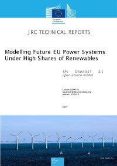

.. Dispa-SET documentation master file, created by
   sphinx-quickstart on Mon Feb  8 16:23:20 2016.
   You can adapt this file completely to your liking, but it should at least
   contain the root `toctree` directive.

The Dispa-SET model
===================

The Dispa-SET model is an open-source unit commitment and optimal dispatch model focused on the balancing and flexibility problems in European grids. Its pre and post-processing tools are written in Python and the main solver can be called via GAMS. 
 
Dispa-SET is mainly developed within the Joint Research Centre of the EU Commission, in close collaboration with the University of Liège and the KU Leuven (Belgium).
 
Downloading Dispa-SET
---------------------
The public version of Dispa-SET can be downloaded in the :ref:`releases` section or from its github repository (using the Clone or Download button on the right side of the screen):
https://github.com/energy-modelling-toolkit/Dispa-SET

How to cite
-----------
Depending on the version that was used, one of the following JRC technical reports can be selected to cite Dispa-SET:

- Kavvadias, K., Hidalgo Gonzalez, I., Zucker, A. and Quoilin, S., Integrated modelling of future EU power and heat systems: The Dispa-SET v2.2 open-source model, JRC Technical Report, EU Commission, 2018

- Quoilin, S., Hidalgo Gonzalez, I. and Zucker, A., Modelling Future EU Power Systems Under High Shares of Renewables: The Dispa-SET 2.1 open-source model, JRC Technical Report, EU Commission, 2017

- Hidalgo González, I., Quoilin, S. and Zucker, A., Dispa-SET 2.0: unit commitment and power dispatch model, Tech. rep., Publications Office of the European Union, 2014.

Documentation
-------------
A pdf documentation of the model is available in the 2017 JRC technical report: `Modelling Future EU Power Systems Under High Shares of Renewables`_.

 
In addition, the lastest model documentation can be obtained by running sphinx in the Docs folder of the project or by consulting the online documentation. This documentation corresponds to the latest available public version of Dispa-SET: 
http://www.dispaset.eu/latest/index.html

Main contributors:
------------------

* `Sylvain Quoilin`_ (KU Leuven, Belgium)) 

* `Konstantinos Kavvadias`_ (Joint Research Centre, EU Commission)

* `Matija Pavičević`_ (KU Leuven, Belgium)

Contents
--------

.. toctree::
   :maxdepth: 1

   overview
   releases
   workflow
   data
   model
   formulations
   implementation
   mid_term
   cases
   dispaset

Indices and tables
------------------

* :ref:`genindex`
* :ref:`modindex`
* :ref:`search`

.. _Modelling Future EU Power Systems Under High Shares of Renewables: https://ec.europa.eu/jrc/en/publication/eur-scientific-and-technical-research-reports/modelling-future-eu-power-systems-under-high-shares-renewables-dispa-set-21-open-source

.. _Sylvain Quoilin: http://www.squoilin.eu

.. _Matija Pavičević: https://www.mpavicevic.com

.. _Konstantinos Kavvadias: http://kavvadias.eu
