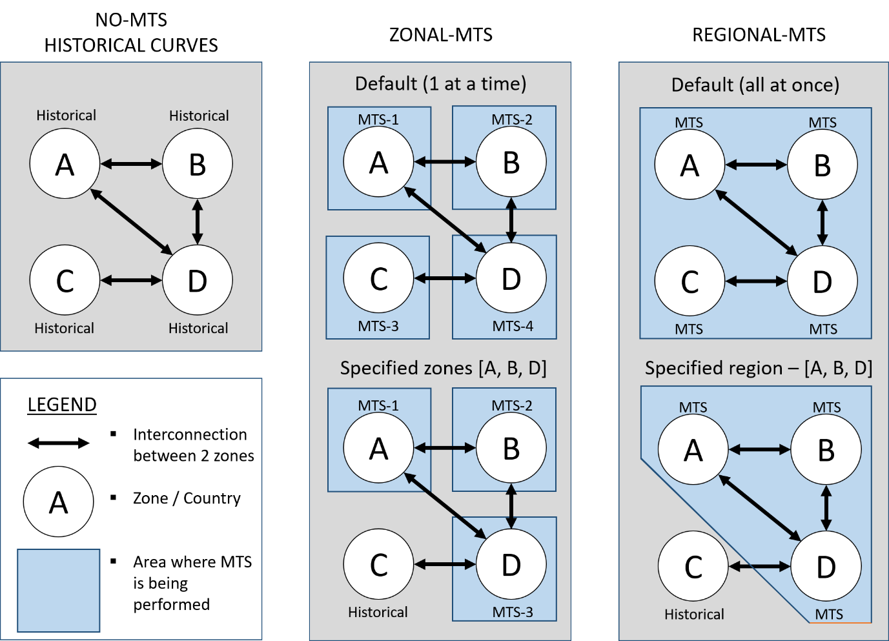

.. _mid_term:

Mid-term hydrothermal coordination
==================================

As discussed in previous sections the simulations depends on exogenous
storage level profiles. These profiles have to be cogerent with the rest
of the input parameters in order to ensure both the feasibility of the problem and
accurate results.

In many cases, collecting accurate and reliable historical storage
levels and profiles in form of hourly timeseries might be a difficult or
close to impossible task. In future scenarios storage levels are usually
forecasted based on the historical data. The lack of such data also
impacts the accurate modelling of such scenarios. In systems with high
shares of hydro dams (HDAM) and pumped hydro storage (HPHS) units, such
as Norway and Albania, this might have a huge impact on the overall
results of the simulation.

In order to avoid this, Dispa-SET’s Midterm
Hydro-Thermal Scheduling (MTS) module represents a simplified version of
the original MILP unit commitment and power dispatch model. This version
is a simplified version of the linear programming formulation which
allows perfect foresight and allocation of water resources for the whole
optimization period and not only for the tactical horizon of each
optimization step. This module enables quick calculation (later also
referring as allocation) of reservoir levels which are then used as
guidance curves (minimum level constraints) in one of the four main
Dispa-SET formulations. The main options are:

-  No-MTS, in which historical curves are used,

-  Zonal-MTS, in which MTS is run for each Zone individually,

-  Regional-MTS, in which MTS is run for two or more Zones from the
   selected region simultaneously.

MTS options
-----------

This section describes the above options available in the Dispa-SET. It
is worthwhile to note that each MTS method and/or modelling formulation
can be applied to the same input dataset. This allows comparing the
various methods in terms of computational efficiency, but also in terms
of accuracy. Graphical summary of MTS options is available in Figure:

|mts_flow|

.. note::
    The MTS optimization (process) is being executed in the preprocessing
    phase. Here the simplified LP optimization estimates the reservoir
    levels for the entire year. These newly computed reservoir levels are
    then imposed as minimum level constraint used in the last time interval
    of the rolling horizon. As preprocessing includes LP optimization, it
    might take a while to complete and will be highly dependent on the
    number of selected zones (the more zones are selected the longer it will
    take to build the model). Depending on the operating system, command
    prompt may pop-up and interrupt other processes several times.

NO-MTS (Historical Curves)
^^^^^^^^^^^^^^^^^^^^^^^^^^

*HISTORICAL* is the standard formulation of the Dispa-SET model. All
reservoir levels are imposed as external timeseries in form of scaled
reservoir levels (in range from 0 - 1). These reservoir levels are used
as minimum level constraint in the last time interval of the rolling
horizon.

ZONAL-MTS
^^^^^^^^^

*ZONAL* formulation can be used in two ways:
1) If not specified otherwise (default option), MTS will be run for each
of the selected zones individually. For a system of four zones
configured as shown in figure 1, each of the zones A, B, C & D MTS will
be run once. In this formulation NTC capacities are not considered.
Instead, default cross border flows from the database are used. .
2) Zones where MTS should be run can also be specified in the list of
zones. In this case, MTS module will only be run in the specified zones.
In our example with four zones, zones A, B & D are selected for the MTS,
while zone C keeps the default values from the database.

REGIONAL-MTS
^^^^^^^^^^^^

*REGIONAL* formulation can be used in the same way as zonal
formulation.

1) If not specified otherwise, MTS will be run once, for the whole
region at once. For the system of four zones configured as shown in
figure 1, zones A, B, C & D will be regarded as a region. In this
formulation MTS will compute reservoir levels based on additional
criteria such as available net transfer capacities (NTC) instead of
historical cross border flows (CBF).

2) Region where MTS should be run can also be specified in the list of
zones contained within one region. In this case MTS module will be run
only in the selected region. In our example zones A, B & D. Zone C keeps
the default values from the database. This formulation generates even
more accurate results compared to the zonal formulation but might
increase the memory usage and computation time significantly.

How to call MTS
---------------

MTS module is called automatically if the relevant parameters indicate the use of it.
During the build phase Dispa-SET will read the MTS parameters from the Config file (either .xlsx or
.yml), execute the MTS module and build SimData with newly computed
reservoir levels. Additional options also allow selection of specific
zones and ploting the difference between the historical and newly
computed reservoir levels (this is only useful for debugging purposes).
The latter is triggered if the `build_simulation` functions is called with
the flag `mts_plot=True`.

Selection of MTS options inside the Config file:

+-----------------------------------+-----------------------------------+
| **Config.xlsx**                   | **Config.yml**                    |
+===================================+===================================+
| Hydro scheduling                  | HydroScheduling:                  |
+-----------------------------------+-----------------------------------+
| -  Off                            | -  ‘Off’                          |
|                                   |                                   |
| -  Regional                       | -  ‘Regional’                     |
|                                   |                                   |
| -  Zonal                          | -  ‘Zonal’                        |
+-----------------------------------+-----------------------------------+
| Hydro scheduling horizon          | HydroSchedulingHorizon:           |
+-----------------------------------+-----------------------------------+
| -  Annual                         | -  ‘Annual’                       |
|                                   |                                   |
| -  Stop-date driven               | -  ‘Stop-date driven’             |
+-----------------------------------+-----------------------------------+
| Initial/Final reservoir level     | InitialFinalReservoirLevel:       |
+-----------------------------------+-----------------------------------+
| -  TRUE                           | -  1.0                            |
|                                   |                                   |
| -  FALSE                          | -  0.0                            |
+-----------------------------------+-----------------------------------+
| -  Initial level & <- Final level | ReservoirLevelInitial: &          |
|                                   | ReservoirLevelFinal:              |
+-----------------------------------+-----------------------------------+
| -  ‘’                             | -  ‘’                             |
|                                   |                                   |
| -  0 - 1                          | -  0 - 1                          |
+-----------------------------------+-----------------------------------+

Examples
--------

Computing reservoir levels by using the MTS module increases the
accuracy of HDAM and HPHS units and avoids infeasible ramping up/down
rates proposed by the historical levels. A good example of one such case
is when the difference between initial and final reservoir levels is
higher than the sum of all the inflows during that time horizon.

Lets assume that ReservoirLevelInital = 1 MWh , ReservoirLevelFinal = 30
MWh, Pmax = 1 MW, InFlows = 1 MW per hour which totals 24 MWh for
horizon length of one day. In this case the reservoir cannot reach the
storage target as it is constrained by the generation capacity.

This would produce infeasible solution which would then have a price of
water slackof 100€/MWh imposed on the difference between historical and
calculated reservoir levels in the last time interval of the rolling
horizon (an imaginary well that fills the reservoir). In our example
this would then amount to 30MWh – 1MWh – 24MWh = 5 MW \*100 €/MWh =
500€.

This might still be the case even if MTS is turned on. Thus, **Hydro
scheduling horizon** option inside the Config files provides additional
flexibility for running the MTS:

-  **Stop-date driven** runs the MTS only between the selected start and
   stop dates, while

-  **Annual** runs the MTS between 01.01. and 31.12. of the selected
   year.

**Initial/Final reservoir levels** can be imposed as TRUE/FALSE
statement. When TRUE Initial and Final reservoir levels can be imposed
externally and should always be in range between 0 and 1 (0 completely
empty reservoir and 1 for 100% full reservoir). This option will
override initial and final reservoir levels for all hydro units in all
selected zones. This might be useful when analysing countries/zones with
data scarcity. When FALSE historical values for Initial and Final
reservoir levels will be considered.

