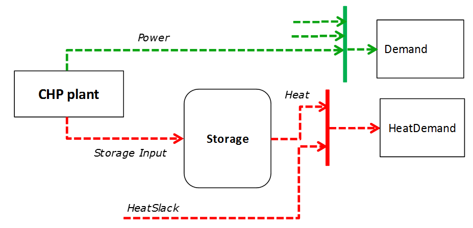
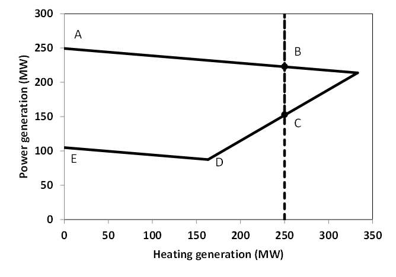
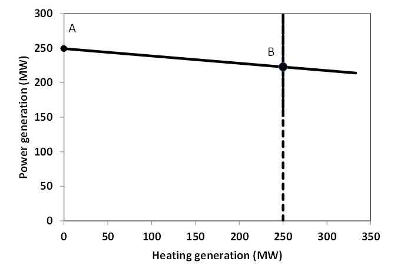

.. _model:

Model Description
=================

The model is expressed as a MILP or LP problem. Continuous variables include the individual unit dispatched power, the shedded load and the curtailed power generation. The binary variables are the commitment status of each unit. The main model features can be summarized as follows:

Variables
^^^^^^^^^

Sets
----

.. table:: 

	======= =================================================================================
	Name	Description
	======= =================================================================================
	au	All units
	f       Fuel types
	h       Hours
	i(h)    Time step in the current optimization horizon
	l       Transmission lines between nodes
	mk      {DA: Day-Ahead, 2U: Reserve up, 2D: Reserve Down}
	n       Zones within each country (currently one zone, or node, per country)
	p       Pollutants
	p2h(au) Power to heat units
	t       Power generation technologies
	th(au)  Units with thermal storage
	tr(t)   Renewable power generation technologies
	u(au)   Generation units (all units minus P2HT units)
	s(u)    Storage units (including hydro reservoirs)
	chp(u)  CHP units
	z(h)	Subset of every simulated hour
	======= =================================================================================

Parameters
----------

.. table::

	======================================= ======= =============================================================
	Name                                    Units   Description
	======================================= ======= =============================================================
	AvailabilityFactor(u,h)                 %       Percentage of nominal capacity available
	CHPPowerLossFactor(u)                   %       Power loss when generating heat
	CHPPowerToHeat(u)                       %       Nominal power-to-heat factor
	CHPMaxHeat(chp)                         MW      Maximum heat capacity of chp plant
	CHPType                                 n.a.    CHP Type
	CommittedInitial(u)                     n.a.    Initial commitment status
	CostFixed(u)                            EUR/h   Fixed costs
	CostLoadShedding(n,h)                   EUR/MWh Shedding costs
	CostRampDown(u)                         EUR/MW  Ramp-down costs
	CostRampUp(u)                           EUR/MW  Ramp-up costs
	CostShutDown(u)                         EUR/u   Shut-down costs for one unit
	CostStartUp(u)                          EUR/u   Start-up costs for one unit
	CostVariable(u,h)                       EUR/MWh Variable costs
	CostHeatSlack(th,h)              	EUR/MWh Cost of supplying heat via other means
	Curtailment(n)                          n.a.    Curtailment {binary: 1 allowed}
	Demand(mk,n,h)                          MW      Hourly demand in each zone
	Efficiency(p2h,h)                       %       Power plant efficiency
	EmissionMaximum(n,p)                    tP      Emission limit per zone for pollutant p
	EmissionRate(u,p)                       tP/MWh  Emission rate of pollutant p from unit u
	FlowMaximum(l,h)			MW	Maximum flow in line
	FlowMinimum(l,h)			MW	Minimum flow in line
	Fuel(u,f)                               n.a.    Fuel type used by unit u {binary: 1 u uses f}
	HeatDemand(au,h)                	MWh/u   Heat demand profile for chp units
	K_QuickStart(n)                      	n.a.	Part of the reserve that can be provided by offline quickstart units
	LineNode(l,n)                           n.a.    Line-zone incidence matrix {-1,+1}
	LoadShedding(n,h)                       MW      Load that may be shed per zone in 1 hour
	Location(au,n)                          n.a.    Location {binary: 1 u located in n}
	LPFormulation				n.a.	Defines the equation that will be present: 1 for LP and 0 for MIP
	Markup					EUR/MW	Markup
	MTS					n.a.	Defines the equation that will be present: 1 for MidTermScheduling, 0 for normal optimization
	Nunits(u)                        	n.a.    Number of units inside the cluster
	OutageFactor(u,h)                       %       Outage factor (100 % = full outage) per hour
	PartLoadMin(u)                          %       Percentage of minimum nominal capacity
	PowerCapacity(au)                       MW/u    Installed capacity
	PowerInitial(u)                         MW/u    Power output before initial period
	PowerMinStable(au)                      MW/u    Minimum power for stable generation
	PowerMustRun(u)                         MW      Minimum power output
	PriceTransmission(l,h)                  EUR/MWh	Price of transmission between zones
	QuickStartPower(u,h)            	MW/h/u  Available max capacity for tertiary reserve
	RampDownMaximum(u)                      MW/h/u  Ramp down limit
	RampShutDownMaximum(u,h)                MW/h/u  Shut-down ramp limit
	RampStartUpMaximum(u,h)                 MW/h/u  Start-up ramp limit
	RampUpMaximum(u)                        MW/h/u  Ramp up limit
	Reserve(t)                              n.a.    Reserve provider {binary}
	StorageCapacity(au)                     MWh/u   Storage capacity (reservoirs)
	StorageChargingCapacity(au)             MW/u    Maximum charging capacity
	StorageChargingEfficiency(au)           %       Charging efficiency
	StorageDischargeEfficiency(au)          %       Discharge efficiency
	StorageInflow(u,h)                      MWh/u   Storage inflows
	StorageInitial(au)                      MWh     Storage level before initial period
	StorageMinimum(au)                      MWh/u   Minimum storage level
	StorageOutflow(u,h)                     MWh/u   Storage outflows (spills)
	StorageProfile(u,h)                     MWh     Storage long-term level profile
	StorageSelfDischarge(au)		%/day	Self discharge of the storage units
	Technology(u,t)                         n.a.    Technology type {binary: 1: u belongs to t}
	TimeDownMinimum(u)                      h       Minimum down time
	TimeStep				h	Duration of a timestep of optimization
	TimeUpMinimum(u)                        h       Minimum up time
	VOLL()                                  EUR/MWh	Value of lost load
	======================================= ======= =============================================================

NB: When the parameter is expressed per unit ("/u"), its value must be provided for one single unit (even in the case of a clustered formulation).

Optimization Variables
----------------------

.. table::

    ======================= ======= =============================================================
    Name                    Units   Description
    ======================= ======= =============================================================
    Committed(u,h)          n.a.    Unit committed at hour h {1,0}
    CostStartUpH(u,h)       EUR     Cost of starting up
    CostShutDownH(u,h)      EUR     Cost of shutting down
    CostRampUpH(u,h)        EUR     Ramping cost
    CostRampDownH(u,h)	    EUR     Ramping cost
    CurtailedPower(n,h)	    MW	    Curtailed power at node n
    Flow(l,h)               MW      Flow through lines
    Heat(au,h)              MW      Heat output by chp plant
    HeatSlack(au,h)         MW      Heat satisfied by other sources
    Power(u,h)              MW      Power output
    PowerConsumption(p2h,h) MW	    Power consumption by P2H
    PowerMaximum(u,h)       MW      Power output
    PowerMinimum(u,h)       MW      Power output
    Reserve_2U(u,h)         MW      Spinning reserve up
    Reserve_2D(u,h)         MW      Spinning reserve down
    Reserve_3U(u,h)         MW      Non spinning quick start reserve up
    ShedLoad(n,h)           MW      Shed load
    StorageInput(au,h)      MWh     Charging input for storage units
    StorageLevel(au,h)      MWh     Storage level of charge
    Spillage(s,h)           MWh     Spillage from water reservoirs
    SystemCost(h)           EUR     Total system cost
    LL_MaxPower(n,h)        MW      Deficit in terms of maximum power
    LL_RampUp(u,h)          MW      Deficit in terms of ramping up for each plant
    LL_RampDown(u,h)        MW      Deficit in terms of ramping down
    LL_MinPower(n,h)        MW      Power exceeding the demand
    LL_2U(n,h)              MW      Deficit in reserve up
    LL_3U(n,h)              MW      Deficit in reserve up - non spinning
    LL_2D(n,h)              MW      Deficit in reserve down
    ======================= ======= =============================================================

Integer Variables
-----------------

.. table::

    ======================= ======= =============================================================
    Name                    Units   Description
    ======================= ======= =============================================================
    Committed(u,h)          n.a.    Number of unit committed at hour h {1 0} or integer 
    StartUp(u,h)            n.a.    Number of unit startups at hour h {1 0}  or integer
    ShutDown(u,h)           n.a.    Number of unit shutdowns at hour h {1 0} or integer
    ======================= ======= =============================================================

Optimisation model
^^^^^^^^^^^^^^^^^^

The aim of this model is to represent with a high level of detail the short-term operation of large-scale power systems solving the so-called unit commitment problem. To that aim we consider that the system is managed by a central operator with full information on the technical and economic data of the generation units, the demands in each node, and the transmission network.

The unit commitment problem considered in this report is a simplified instance of the problem faced by the operator in charge of clearing the competitive bids of the participants into a wholesale day-ahead power market. In the present formulation the demand side is an aggregated input for each node, while the transmission network is modelled as a transport problem between the nodes (that is, the problem is network-constrained but the model does not include the calculation of the optimal power flows).

The unit commitment problem consists of two parts: i) scheduling the start-up, operation, and shut down of the available generation units, and ii) allocating (for each period of the simulation horizon of the model) the total power demand among the available generation units in such a way that the overall power system costs is minimized. The first part of the problem, the unit scheduling during several periods of time, requires the use of binary variables in order to represent the start-up and shut down decisions, as well as the consideration of constraints linking the commitment status of the units in different periods. The second part of the problem is the so-called economic dispatch problem, which determines the continuous output of each and every generation unit in the system. Therefore, given all the features of the problem mentioned above, it can be naturally formulated as a mixed-integer linear program (MILP). However, the problem can also be relaxed to a linear program (LP). 

There is a possibility of Mid Term scheduling. It allows to optimize the level of energy in the storage reservoirs over a year and use it as endogeneous input in the optimization of interest. In that case, the equations linked to unit commitment are ignored.   

Since our goal is to model a large European interconnected power system, we have implemented a so-called tight and compact formulation, in order to simultaneously reduce the region where the solver searches for the solution and increase the speed at which the solver carries out that search. Tightness refers to the distance between the relaxed and integer solutions of the MILP and therefore defines the search space to be explored by the solver, while compactness is related to the amount of data to be processed by the solver and thus determines the speed at which the solver searches for the optimum. Usually tightness is increased by adding new constraints, but that also increases the size of the problem (decreases compactness), so both goals contradict each other and a trade-off must be found.

Objective function
------------------

The goal of the unit commitment problem is to minimize the total power system costs (expressed in EUR in equation ), which are defined as the sum of different cost items, namely: start-up and shut-down, fixed, variable, ramping, transmission-related and load shedding (voluntary and involuntary) costs.

.. math::
	\begin{split}
	min & \Big[ \sum_{u,i} CostFixed_{u} \cdot Committed_{u,i} \cdot TimeStep \\
	& + \sum_{u,i} ( CostStartUpH_{u,i} + CostShutDownH_{u,i})   \\
	& + \sum_{u,i} (CostRampUpH_{u,i} + CostRampDownH_{u,i})  \\
	& + \sum_{u,i} CostVariable_{u,i} \cdot Power_{u,i} \cdot TimeStep    \\
	& + \sum_{l,i} PriceTransimission_{l,i} \cdot Flow_{l,i} \cdot TimeStep \\ 
	& + \sum_{n,i} CostLoadShedding_{i,n} \cdot ShedLoad_{i,n} \cdot TimeStep  \\
	& + \sum _{th,i} CostHeatSlack_{th,i} \cdot  HeatSlack_{th,i} \cdot TimeStep) \\
	& + \sum _{chp,i} CostVariable_{chp,i} \cdot CHPPowerLossFactor_{chp} \cdot Heat_{chp,i} \cdot TimeStep) \\
	& + \sum_{i,n} VOLL_{Power} \cdot \left( \mathit{LL}_{MaxPower,i,n} + \mathit{LL}_{MinPower,i,n} \right) \cdot TimeStep \\
	& + \sum_{i,n} 0.8 \cdot VOLL_{Reserve} \cdot \left( LL_{2U,i,n} + LL_{2D,i,n}+ LL_{3U,i,n} \right) \cdot TimeStep \\
	& + \sum_{u,i} 0.7 \cdot VOLL_{Ramp} \cdot \left( LL_{RampUp,u,i} + LL_{RampDown,u,i} \right)\cdot TimeStep \\
	& + \sum_{s,i} CostOfSpillage \cdot spillage_{s,i} \\
	& + \sum_{s,i} WaterValue\cdot WaterSlack_s \Big]
	\end{split}

The costs can be broken down as:  

* Fixed costs: depending on whether the unit is on or off.
* Variable costs: stemming from the power output of the units. 
* Start-up costs: due to the start-up of a unit.
* Shut-down costs: due to the shut-down of a unit.
* Ramp-up: emerging from the ramping up of a unit.
* Ramp-down: emerging from the ramping down of a unit.
* Load shed: due to necessary load shedding.
* Transmission: depending of the flow transmitted through the lines.
* Loss of load: power exceeding the demand or not matching it, ramping and reserve.
* spillage: due to spillage in storage.
* Water : cost of water coming from unsatisfied water level at the end of the optimization period.

The variable production costs (in EUR/MWh), are determined by fuel and emission prices corrected by the efficiency (which is considered to be constant for all levels of output in this version of the model) and the emission rate of the unit (equation ):

.. math::
	\begin{align}
	 \mathit{CostVariable}_{u,h}= &\mathit{Markup}_{u,h} + \sum _{n,f}\left(\frac{\mathit{Fuel}_{u,f} \cdot \mathit{FuelPrice}_{n,f,h} \cdot \mathit{Location}_{u,n}}{\mathit{Efficiency}_u}\right)\\
				      & + \sum _p\left(\mathit{EmissionRate}_{u,p} \cdot \mathit{PermitPrice}_p\right)
	\end{align}

The variable cost includes an additional mark-up parameter that can be used for calibration and validation purposes.

From version 2.3, Dispa-SET uses a 3 integers formulations of the up/down status of all units. According to this formulation, the number of start-ups and shut-downs is at each time step is computed by:

.. math::

	\mathit{Committed}_{u,i}-\mathit{Committed}_{u,i-1} = \mathit{StartUp}_{u,i} - \mathit{ShutDown}_{u,i}

The start-up and shut-down costs are positive variables, calculated from the number of startups/shutdowns at each time step:

.. math::
	\begin{align}
		\mathit{CostStartUp}_{u,i} &= \mathit{CostStartUp}_u \cdot \mathit{StartUp}_{u,i}\\
		\mathit{CostShutDown}_{u,i} &= \mathit{CostShutDown}_u \cdot \mathit{ShutDown}_{u,i}
	\end{align}

Renewable units are enforced commited when the availability factor is non null and the outage factor is not 1 and decommited in the other case.
	
Ramping costs are defined as positive variables (i.e. negative costs are not allowed) and are computed with the following equations:

.. math:: 
	\begin{align}
		\mathit{CostRampUp}_{u,i} &\geq \mathit{CostRampUp}_u \cdot \left(\mathit{Power}_{u,i}-\mathit{Power}_{u,i-1}\right)\\
		\mathit{CostRampDown}_{u,i} &\geq \mathit{CostRampDown}_u \cdot (\mathit{Power}_{u,i-1}-\mathit{Power}_{u,i})
	\end{align}

It should be noted that in case of start-up and shut-down, the ramping costs are added to the objective function. Using start-up, shut-down and ramping costs at the same time should therefore be performed with care.

In the current formulation, all other costs (fixed and variable costs, transmission costs, load shedding costs) are considered as exogenous parameters. 

As regards load shedding, the model considers the possibility of voluntary load shedding resulting from contractual arrangements between generators and consumers. Additionally, in order to facilitate tracking and debugging of errors, the model also considers some variables representing the capacity the system is not able to provide when the minimum/maximum power, reserve, or ramping constraints are reached. These lost loads are a very expensive last resort of the system used when there is no other choice available. The different lost loads are assigned very high values (with respect to any other costs). This allows running the simulation without infeasibilities, thus helping to detect the origin of the loss of load. In a normal run of the model, without errors, all these variables are expected to be equal to zero.

Day-ahead energy balance
------------------------

The main constraint to be met is the supply-demand balance, for each period and each zone, in the day-ahead market (equation ). According to this restriction, the sum of all the power produced by all the units present in the node (including the power generated by the storage units), the power injected from neighbouring nodes, and the curtailed power from intermittent sources is equal to the load in that node, plus the power consumed for energy storage, minus the load interrupted and the load shed.

.. math::
	\begin{align}
	 \sum _u\left(\mathit{Power}_{u,i} \cdot \mathit{Location}_{u,n}\right) + \sum _l\left(\mathit{Flow}_{l,i} \cdot \mathit{LineNode}_{l,n}\right)\\
 	 = \mathit{Demand}_{\mathit{DA},n,h} + \sum _r\left(\mathit{StorageInput}_{s,h} \cdot \mathit{Location}_{s,n}\right) -\mathit{ShedLoad}_{n,i} \\
	   + \sum_{p2h} \mathit{PowerConsumption}_{p2h,i} \cdot \mathit{Location}_{p2h,n}  - \mathit{LL_{MaxPower}}_{n,i} + \mathit{LL_{MinPower}}_{n,i} 
	\end{align}

Reserve constraints
-------------------

Besides the production/demand balance, the reserve requirements (upwards and downwards) in each node must be met as well. In Dispa-SET, three types of reserve requirements are taken into account:

- Upward secondary reserve (2U): reserve that can only be covered by spinning units
- Downward secondary reserve (2D): reserve that can only be covered by spinning units
- Upward tertiary reserve (3U): reserve that can be covered either by spinning units or by quick-start offline units

The secondary reserve capability of committed units is limited by the capacity margin between current and maximum power output:

.. math::
	\begin{align}
		\mathit{Reserve_{2U}}_{u,i} \leq& \mathit{PowerCapacity}_u \cdot \mathit{AvailabilityFactor}_{u,i} \cdot (1-\mathit{OutageFactor}_{u,i})  \cdot  \mathit{Committed}_{u,i}\\	 
		& - \mathit{Power}_{u,i}
	\end{align}

The same applies to the downwards secondary reserve capability, with an additional term to take into account the downard reserve capability of pumping storage units:

.. math::
	\begin{align}
		\mathit{Reserve_{2D}}_{u,i} \leq &\; \mathit{Power}_{u,i} - \mathit{PowerMustRun}_{u,i} \cdot  \mathit{Committed}_{u,i} \\
		&+ (\mathit{StorageChargingCapacity}_u \cdot \mathit{Nunits}_u - \mathit{StorageInput}_{u,i})
	\end{align}

The quick start (non-spining) reserve capability is given by:

.. math::

	\mathit{Reserve_{3U}}_{u,i} \leq (\mathit{Nunits}_u - \mathit{Committed}_{u,i}) \cdot  \mathit{QuickStartPower}_{u,i} \cdot \mathit{TimeStep}

The secondary reserve demand should be fulfilled at all times by all the plants allowed to participate in the reserve market:

.. math::
	\begin{align}
		\mathit{Demand}_{2U,n,h} \leq & \sum _{u,t}\left(\mathit{Reserve_{2U}}_{u,i} \cdot \mathit{Technology}_{u,t} \cdot \mathit{Reserve}_t \cdot \mathit{Locatio}n_{u,n}\right)\\
		& + \mathit{LL_{2U}}_{n,i}
	\end{align}

The same equation applies to downward reserve requirements (2D).

The tertiary reserve can also be provided by non-spinning units. The inequality is thus transformed into:

.. math::
	\begin{align}
		\mathit{Demand}_{3U,n,h} \leq & \sum _{u,t}[(\mathit{Reserve_{2U}}_{u,i} + \mathit{Reserve_{3U}}_{u,i} ) \cdot \mathit{Technology}_{u,t} \cdot \mathit{Reserve}_t \cdot \mathit{Locatio}n_{u,n} ]\\
		&+ \mathit{LL_{3U}}_{n,i}
	\end{align}

The reserve requirements are defined by the users. In case no input is provided a default formula is used to evaluate the needs for secondary reserves as a function of the maximum expected load for each day. The default formula is described by:

.. math::

	\mathit{Demand}_{2U,n,i}=\sqrt{10 \cdot \underset h{\mathit{max}}\left(\mathit{Demand}_{\mathit{DA},n,h}\right) + 150^2}-150

Downward reserves are defined as 50\% of the upward margin:

.. math::

	\mathit{Demand}_{2D,n,h}=0.5 \cdot \mathit{Demand}_{2U,n,h}

Power output bounds
-------------------

The minimum power output is determined by the must-run or stable generation level of the unit if it is committed:

.. math::
	\mathit{Power}\mathit{MustRun}_{u,i} \cdot \mathit{Committed}_{u,i}  \leq \mathit{Power}_{u,i} 

In the particular case of CHP unit (extration type or power-to-heat type), the minimum power is defined for for a heat demand equal to zero. If the unit produces heat, the minimum power must be reduced according to the power loss factor and the previous equation is replaced by:

.. math::

	\mathit{Power}\mathit{MustRun}_{chp,i} \cdot \mathit{Committed}_{chp,i}

	- \mathit{StorageInput}_{chp,i} \cdot \mathit{CHPPowerLossFactor}_u

	 \leq \mathit{Power}_{chp,i}

The power output is limited by the available capacity, if the unit is committed:

.. math::

	\mathit{Power}_{u,i}

	 \leq \mathit{PowerCapacity}_u \cdot \mathit{AvailabilityFactor}_{u,i}

	 \cdot (1-\mathit{OutageFactor}_{u,i}) \cdot \mathit{Committed}_{u,i}

The availability factor is used for renewable technologies to set the maximum time-dependent generation level. It is set to one for the traditional power plants. The outage factor accounts for the share of unavailable power due to planned or unplanned outages.

Ramping Constraints
-------------------
Each unit is characterized by a maximum ramp up and ramp down capability. This is translated into the following inequality for the case of ramping up:

.. math::

	\mathit{Power}_{u,i} - \mathit{Power}_{u,i-1} \leq 

	(\mathit{Committed}_{u,i} - \mathit{StartUp}_{u,i}) \cdot \mathit{RampUpMaximum}_{u} \cdot \mathit{TimeStep}

	+ \mathit{StartUp}_{u,i} \cdot \mathit{RampStartUpMaximum}_{u} \cdot \mathit{TimeStep}

	- \mathit{ShutDown}_{u,i} \cdot \mathit{PowerMustRun}_{u,i}

	+ \mathit{LL_{RampUp}}_{u,i}

and for the case of ramping down:

.. math::

	\mathit{Power}_{u,i-1} - \mathit{Power}_{u,i} \leq 

	(\mathit{Committed}_{u,i} - \mathit{ShutDown}_{u,i}) \cdot \mathit{RampDownMaximum}_{u} \cdot \mathit{TimeStep}

	+ \mathit{ShutDown}_{u,i} \cdot \mathit{RampShutDownMaximum}_{u} \cdot \mathit{TimeStep}

	- \mathit{StartUp}_{u,i} \cdot \mathit{PowerMustRun}_{u,i}

	+ \mathit{LL_{RampDown}}_{u,i}

Note that this formulation is valid for both the clustered formulation and the binary formulation. In the latter case (there is only one unit u), if the unit remains committed, the inequality simplifies into:

.. math::

	\mathit{Power}_{u,i} - \mathit{Power}_{u,i-1} \leq 

	\mathit{RampUpMaximum}_{u} \cdot \mathit{TimeStep} + \mathit{LL_{RampUp}}_{u,i}

If the unit has just been committed, the inequality becomes:

.. math::

	\mathit{Power}_{u,i} - \mathit{Power}_{u,i-1} \leq 

	\mathit{RampStartUpMaximum}_{u} \cdot \mathit{TimeStep} + \mathit{LL_{RampUp}}_{u,i}

And if the unit has just been stopped:

.. math::

	\mathit{Power}_{u,i} - \mathit{Power}_{u,i-1} \leq 

	- \mathit{PowerMustRun}_{u,i} + \mathit{LL_{RampUp}}_{u,i}

Minimum up and down times
-------------------------

The operation of the generation units is also limited as well by the amount of time the unit has been running or stopped. In order to avoid excessive ageing of the generators, or because of their physical characteristics, once a unit is started up, it cannot be shut down immediately. Reciprocally, if the unit is shut down it may not be started immediately. 

To model this in MILP, the number of startups/shutdowns in the last N hours must be limited, N being the minimum up or down time. For the minimum up time, the number of startups during this period cannot be higher than the number of currently committed units:

.. math::

	\sum _{ii=i-\frac{\mathit{TimeUpMinimum}_u}{\mathit{TimeStep}}}^{i} \mathit{StartUp}_{u,ii} \leq \mathit{Committed}_{u,i}

i.e. the currently committed units are not allowed to have performed multiple on/off cycles between the optimization time minus TimeUpMinimum and the optimization time. The implied number of periods is computed by the ratio of TimeUpMinimum and TimeStep. If TimeUpMinimum is not a multiple of TimeStep, their fraction is rounded upwards. In case of a binary formulation (Nunits=1), if the unit is ON at time i, only one startup is allowed in the last TimeUpMinimum periods. If the unit is OFF at time i, no startup is allowed.

A similar inequality can be written for the ninimum down time:

.. math::

	\sum _{ii=i-\frac{\mathit{TimeDownMinimum}_u}{\mathit{TimeStep}}}^{i} \mathit{ShutDown}_{u,ii} \leq \mathit{Nunits}_u - \mathit{Committed}_{u,i}

Storage-related constraints
---------------------------

Generation units with energy storage capabilities (mostly large hydro reservoirs and pumped hydro storage units) must meet additional restrictions related to the amount of energy stored. Storage units are considered to be subject to the same constraints as non-storage power plants. In addition to those constraints, storage-specific restrictions are added for the set of storage units (i.e. a subset of all units). These restrictions include the storage capacity, inflow, outflow, charging, charging capacity, charge/discharge efficiencies, etc. Discharging is considered as the standard operation mode and is therefore linked to the Power variable, common to all units.

The first constraint imposes that the energy stored by a given unit is bounded by a minimum value:

.. math::

	\mathit{StorageMinimum}_s \leq \mathit{StorageLevel}_{s,i} \cdot \mathit{Nunits}_s

In the case of a storage unit, the availability factor applies to the charging/discharging power, but also to the storage capacity. The storage level is thus limited by:

.. math::

	\mathit{StorageLevel}_{s,i} \leq \mathit{StorageCapacity}_s \cdot \mathit{AvailabilityFactor}_{s,i} \cdot \mathit{Nunits}_s

The energy added to the storage unit is limited by the charging capacity. Charging is allowed only if the unit is not producing (discharging) at the same time (i.e. if Committed, corresponding to the {\textquotedbl}normal{\textquotedbl} mode, is equal to 0).

.. math::

	\mathit{StorageInput}_{s,i} \leq 

	\mathit{StorageChargingCapacity}_s \cdot (\mathit{Nunits}_s-\mathit{Committed}_{s,i})

Discharge is limited by the level of charge of the storage unit:

.. math::

	\frac{\mathit{Power}_{i,s}\cdot \mathit{TimeStep}}{\mathit{StorageDischargeEfficienc}y_s} + \mathit{StorageOutflow}_{s,i} \cdot \mathit{Nunits}_s \cdot \mathit{TimeStep}

	+ \mathit{Spillage}_{s,i} -\mathit{StorageInflow}_{s,i} \cdot \mathit{Nunits}_s \cdot \mathit{TimeStep}

	\leq \mathit{StorageLevel}_{s,i}

It is worthwhile to note that StorageInflow and StorageOuflow must be multiplied by the number of units because they are defined for a single storage plant. On the contrary StorageLevel, Spillage and Power are defined for all units s.

Charge is limited by the level of charge of the storage unit:

.. math::

	\mathit{StorageInput}_{s,i} \cdot \mathit{StorageChargingEfficiency}_s \cdot \mathit{TimeStep}

	- \mathit{StorageOutflow}_{s,i} \cdot \mathit{Nunits}_s \cdot \mathit{TimeStep}-  \mathit{Spillage}_{s,i}
	
	+ \mathit{StorageInflow}_{s,i} \cdot \mathit{Nunits}_s \cdot \mathit{TimeStep}

	\leq \mathit{StorageCapacity}_s \cdot \mathit{AvailabilityFactor}_{s,i} 

	- \mathit{StorageLevel}_{s,i}

Besides, the energy stored in a given period is given by the energy stored in the previous period, net of charges and discharges:

.. math::
	
	\mathit{StorageLevel}_{s,i-1} + \mathit{StorageInflow}_{s,i}  \cdot \mathit{Nunits}_s \cdot \mathit{TimeStep}

	+ \mathit{StorageInput}_{s,i} \cdot \mathit{StorageChargingEfficiency}_s \cdot \mathit{TimeStep}

	= \mathit{StorageLevel}_{s,i} + \mathit{StorageOutflow}_{s,i} \cdot \mathit{Nunits}_s \cdot \mathit{TimeStep} 

	+ \frac{\mathit{Power}_{s,i}\cdot \mathit{TimeStep}}{\mathit{StorageDischargeEfficienc}y_s}

Some storage units are equiped with large reservoirs, whose capacity at full load might be longer than the optimisation horizon. Therefore, a minimum level constraint is required for the last hour of the optimisation, which otherwise would systematically tend to empty the reservoir as much a possible. An exogenous minimum profile is thus provided and the following constraint is applied:

.. math::

	\mathit{StorageLevel}_{s,N} \geq StorageFinalMin_{s} + WaterSlack_s

where N is the last period of the optimization horizon, StorageProfile is a non-dimensional minimum storage level provided as an exogenous input and WaterSlack is a variable defining the unsatified water level. The price associated to that water is very high.

Heat production constraints (CHP plants only)
---------------------------------------------

In DispaSET Power plants can be indicated as CHP satisfying one heat demand.  Heat Demand can be covered either by a CHP plant or by alternative heat supply options (Heat Slack).

The following two heat balance constraints are used for any CHP and P2H plant types.

.. math::

    Heat(th,i) + HeatSlack(th,i)
    = HeatDemand(th,i)

.. math::

    StorageInput_{chp,i} \leq CHPMaxHeat_{chp} \cdot \mathit{Nunits}_{chp} 

The constraints between heat and power production differ for each plant design and explained within the following subsections.

Steam plants with Backpressure turbine
~~~~~~~~~~~~~~~~~~~~~~~~~~~~~~~~~~~~~~
This options includes steam-turbine based power plants with a backpressure turbine. The feasible operating region is between AB. The slope of the line is the heat to power ratio.

.. figure:: figures/backpressure.png
       :scale: 50 %
       :align: center

.. math::

    Power_{chp,i}
    =
    StorageInput_{chp,i} \cdot CHPPowerToHeat_{chp}

Steam plants with Extraction/condensing turbine
~~~~~~~~~~~~~~~~~~~~~~~~~~~~~~~~~~~~~~~~~~~~~~~
This options includes steam-turbine based power plants with an extraction/condensing turbine. The feasible operating region is within ABCDE.
The vertical dotted line BC corresponds to the minimum condensation line (as defined by *CHPMaxHeat*). The slope of the DC line is the heat to power ratio and the slope of the AB line is the inverse of the power penalty ratio.

.. math::
    Power_{chp,i}
    \geq
    StorageInput_{chp,i} \cdot CHPPowerToHeat_{chp}

.. math::
    Power_{chp,i}
    \leq
    PowerCapacity_{chp} \cdot \mathit{Nunits} -

    StorageInput_{chp,i} \cdot CHPPowerLossFactor_{chp}

.. math::
    Power_{chp,i}
    \geq
    PowerMustRun_{chp,i} - StorageInput_{chp,i} \cdot CHPPowerLossFactor_{chp}

Power plant coupled with any power to heat option
~~~~~~~~~~~~~~~~~~~~~~~~~~~~~~~~~~~~~~~~~~~~~~~~~

This option includes power plants coupled with resistance heater or heat pumps. The feasible operating region is between ABCD. The slope of the AB and CD line is the inverse of the COP or efficiency.
The vertical dotted line corresponds to the heat pump (or resistance heater) thermal capacity (as defined by *CHPMaxHeat*)

.. math::

    Power_{chp,i}
    \leq
    PowerCapacity_{chp} - StorageInput_{chp,i} \cdot CHPPowerLossFactor_{chp}

.. math::
    Power_{chp,i}
    \geq
    PowerMustRun_{chp,i} - StorageInput_{chp,i} \cdot CHPPowerLossFactor_{chp}

Heat Storage
~~~~~~~~~~~~
Heat storage is modeled in a similar way as electric storage as follows:

Heat Storage balance:

.. math::

    StorageLevel_{th,i-1}
    +StorageInput_{th,i} \cdot TimeStep
    =

    StorageLevel_{th,i}
    +Heat_{th,i} \cdot TimeStep

	+ StorageSelfDischarge_{th} \cdot StorageLevel_{th,i}\cdot TimeStep/24

Storage level must be above a minimum and below storage capacity:

.. math::

    StorageMinimum_{th} \cdot Nunits_{th}
    \leq
    StorageLevel_{chp,i}
    \leq
    StorageCapacity_{th} \cdot \mathit{Nunits}_{th}

Emission limits
---------------

The operating schedule also needs to take into account any cap on the emissions (not only CO2) from the generation units existing in each node:

.. math::

	\sum _u\left(\mathit{Power}_{u,i} \cdot \mathit{EmisionRate}_{u,p} \cdot TimeStep \cdot \mathit{Location}_{u,n}\right)

	\leq \mathit{EmisionMaximum}_{n,p}

It is important to note that the emission cap is applied to each optimisation horizon: if a rolling horizon of one day is adopted for the simulation, the cap will be applied to all days instead of the whole year.

Network-related constraints
---------------------------

The flow of power between nodes is limited by the capacities of the transmission lines:

.. math::

	\mathit{FlowMinimum}_{l,i} \leq \mathit{Flow}_{l,i}

	\mathit{Flow}_{l,i} \leq \mathit{FlowMaximum}_{l,i}

In this model a simple Net Transfer Capacity (NTC) between countries approach is followed. No DC power flow or Locational Marginal Pricing (LMP) model is implemented.

Load shedding
-------------

If load shedding is allowed in a node, the amount of shed load is limited by the shedding capacity contracted on that particular node (e.g. through interruptible industrial contracts)

.. math::

	\mathit{ShedLoad}_{n,i} \leq \mathit{LoadShedding}_{n,i}

Linear Program (LP) optimization
^^^^^^^^^^^^^^^^^^^^^^^^^^^^^^^^
A possible simplification of the model is to run it as a LP instead of MILP. In that case, the LPFormulation parameter needs to be set to 1 (and to 0 otherwise). 

In that case, the commitment status variables Commited, StartUp and ShutDown are not defined as binary and Commited is set smaller than 1. The equations describing the cost of starting up and shutting down are ignored, as well as the ones enforcing minimum up and down times.   	

Mid Term Scheduling (MTS)
^^^^^^^^^^^^^^^^^^^^^^^^^
In some cases, collecting accurate and reliable historical storage levels and profiles in form of hourly timeseries might be a difficult or close to impossible task. In future scenarios storage levels are usually forecasted based on the historical data. The lack of such data also impacts the accurate modelling of such scenarios. In systems with high shares of hydro dams (HDAM) and pumped hydro storage (HPHS) units, such as Norway and Albania, this might have a huge impact on the overall results of the simulation. In order to avoid this, Dispa-SET’s Midterm Hydro-Thermal Scheduling (MTS) module represents a simplified version of the original MILP unit commitment and power dispatch model. This version is a simplified version of the linear programming formulation which allows perfect foresight and allocation of water resources for the whole optimization period and not only for the tactical horizon of each optimization step. This module enables quick calculation (later also referring as allocation) of reservoir levels which are then used as guidance curves (minimum level constraints) in one of the four main Dispa-SET formulations. The main options are:

* No-MTS, in which historical curves are used,
* Zonal-MTS, in which MTS is run for each Zone individually, 
* Regional-MTS, in which MTS is run for two or more Zones from the selected region simultaneously.

It is worthwhile to note that each MTS method and/or modelling formulation can be applied to the same input dataset. This allows comparing the various methods in terms of computational efficiency, but also in terms of accuracy. Graphical summary of MTS options are the following:

.. image:: figures/Graphical_MTS.png 

Important note
--------------
The MTS optimization (process) is being executed in the preprocessing phase. Here the simplified LP optimization estimates the reservoir levels for the entire year. These newly computed reservoir levels are then imposed as minimum level constraint used in the last time interval of the rolling horizon. As preprocessing includes LP optimization, it might take a while to complete and will be highly dependent on the number of selected zones (the more zones are selected the longer it will take to build the model). Depending on the operating system, command prompt may pop-up and interrupt other processes several times. 

Model in MTS mode
-----------------
When MTS is activated, some equations are dropped/modified. MTS mode is activated by setting parameter MTS to 1. In this configuration, all equations concerning unit commitment are not considered and the binary variables Commited, StartUp and ShutDown are not defined. The following constraints are therefore ignored:
 
* The commitment equations
* The minimum Up and Down times equations
* The Ramp up and Ramp down limitation equations

Also, due to the absence of the variable Commitment, some equations are modified.
Firstly, the cost equation is modified as follow:

.. math::
	\begin{split}
	min & \Big[ \sum_{u,i} CostFixed_{u}  \cdot TimeStep \\
	& + \sum_{u,i} ( CostStartUpH_{u,i} + CostShutDownH_{u,i})   \\
	& + \sum_{u,i} (CostRampUpH_{u,i} + CostRampDownH_{u,i})  \\
	& + \sum_{u,i} CostVariable_{u,i} \cdot Power_{u,i} \cdot TimeStep    \\
	& + \sum_{l,i} PriceTransimission_{l,i} \cdot Flow_{l,i} \cdot TimeStep \\ 
	& + \sum_{n,i} CostLoadShedding_{i,n} \cdot ShedLoad_{i,n} \cdot TimeStep  \\
	& + \sum _{th,i} CostHeatSlack_{th,i} \cdot  HeatSlack_{th,i} \cdot TimeStep) \\
	& + \sum _{chp,i} CostVariable_{chp,i} \cdot CHPPowerLossFactor_{chp} \cdot Heat_{chp,i} \cdot TimeStep) \\
	& + \sum_{i,n} VOLL_{Power} \cdot \left( \mathit{LL}_{MaxPower,i,n} + \mathit{LL}_{MinPower,i,n} \right) \cdot TimeStep \\
	& + \sum_{i,n} 0.8 \cdot VOLL_{Reserve} \cdot \left( LL_{2U,i,n} + LL_{2D,i,n}+ LL_{3U,i,n} \right) \cdot TimeStep \\
	& + \sum_{s,i} CostOfSpillage \cdot spillage_{s,i} \\
	& + \sum_{s,i} WaterValue\cdot WaterSlack_s \Big]
	\end{split}

The upwards and downwards secondary reserve capabilities of units becomes:

.. math::
	\begin{align}
		\mathit{Reserve_{2U}}_{u,i} \leq& \mathit{PowerCapacity}_u \cdot \mathit{AvailabilityFactor}_{u,i} \cdot (1-\mathit{OutageFactor}_{u,i}) \\	 
		& - \mathit{Power}_{u,i} \\
		\mathit{Reserve_{2D}}_{u,i} \leq &\; \mathit{Power}_{u,i} + (\mathit{StorageChargingCapacity}_u \cdot \mathit{Nunits}_u - \mathit{StorageInput}_{u,i})
	\end{align}

Also the non spinning reserve is modified:

.. math::

	\mathit{Reserve_{3U}}_{u,i} \leq \mathit{Nunits}_u \cdot  \mathit{QuickStartPower}_{u,i} \cdot \mathit{TimeStep}

The output power available for each unit is now expressed as:

.. math::
	\mathit{Power}_{u,i} \leq \mathit{PowerCapacity} \cdot \mathit{AvailibilityFactor} \cdot (1- \mathit{OutageFactor}) 

Finally, the maximum capacity of storage charging is:

.. math::
	\mathit{StorageInput}_{s,i} \leq \mathit{StorageChargingCapacity}_s \cdot \mathit{Nunits}_s

Rolling Horizon
^^^^^^^^^^^^^^^
The mathematical problem described in the previous sections could in principle be solved for a whole year split into time steps, but with all likelihood the problem would become extremely demanding in computational terms when attempting to solve the model with a realistically sized dataset. Therefore, the problem is split into smaller optimization problems that are run recursively throughout the year. 

The following figure shows an example of such approach, in which the optimization horizon is one day, with a look-ahead (or overlap) period of one day. The initial values of the optimization for day j are the final values of the optimization of the previous day. The look-ahead period is modelled to avoid issues related to the end of the optimization period such as emptying the hydro reservoirs, or starting low-cost but non-flexible power plants. In this case, the optimization is performed over 48 hours, but only the first 24 hours are conserved.

.. image:: figures/rolling_horizon.png

Although the previous example corresponds to an optimization horizon and an overlap of one day, these two values can be adjusted by the user in the Dispa-SET configuration file. As a rule of thumb, the optimization horizon plus the overlap period should at least be twice the maximum duration of the time-dependent constraints (e.g. the minimum up and down times). In terms of computational efficiency, small power systems can be simulated with longer optimization horizons, while larger systems should reduce this horizon, the minimum being one day.

References
^^^^^^^^^^

.. [1] Quoilin, S., Hidalgo Gonzalez, I., & Zucker, A. (2017). Modelling Future EU Power Systems Under High Shares of Renewables: The Dispa-SET 2.1 open-source model. Publications Office of the European Union. 
.. [2] Quoilin, S., Nijs, W., Hidalgo, I., & Thiel, C. (2015). Evaluation of simplified flexibility evaluation tools using a unit commitment model. IEEE Digital Library. 
.. [3] Quoilin, S., Gonzalez Vazquez, I., Zucker, A., & Thiel, C. (2014). Available technical flexibility for balancing variable renewable energy sources: case study in Belgium. Proceedings of the 9th Conference on Sustainable Development of Energy, Water and Environment Systems. 
