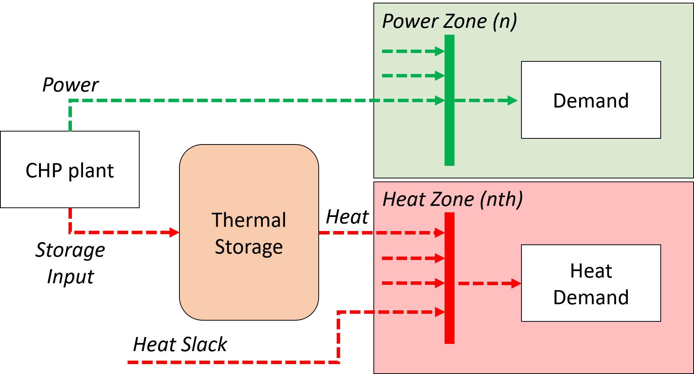
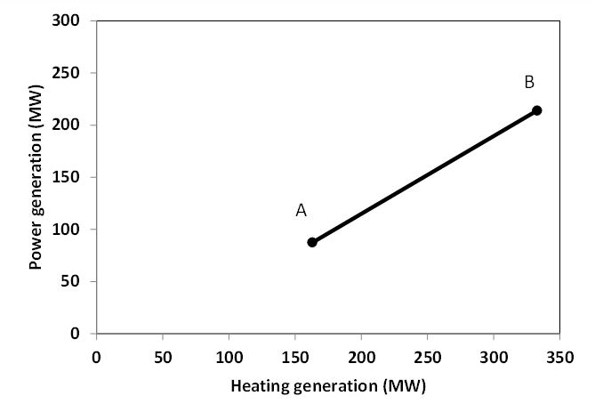
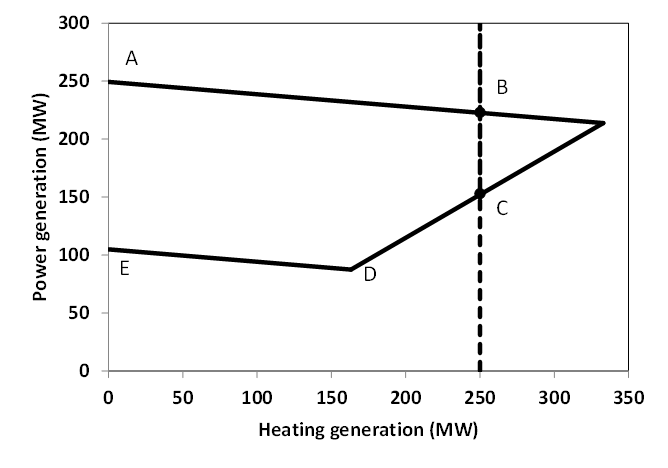
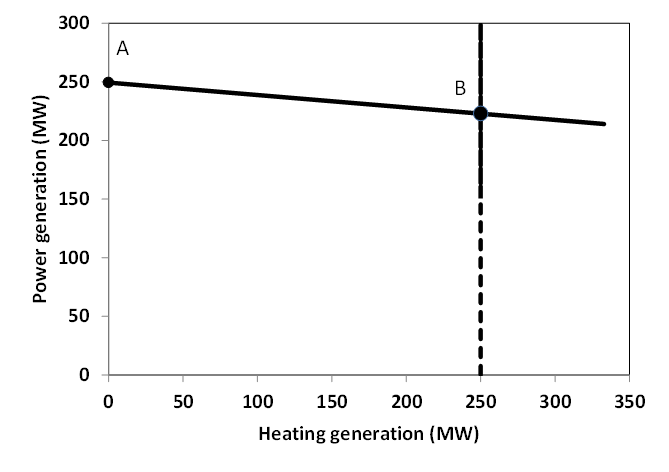
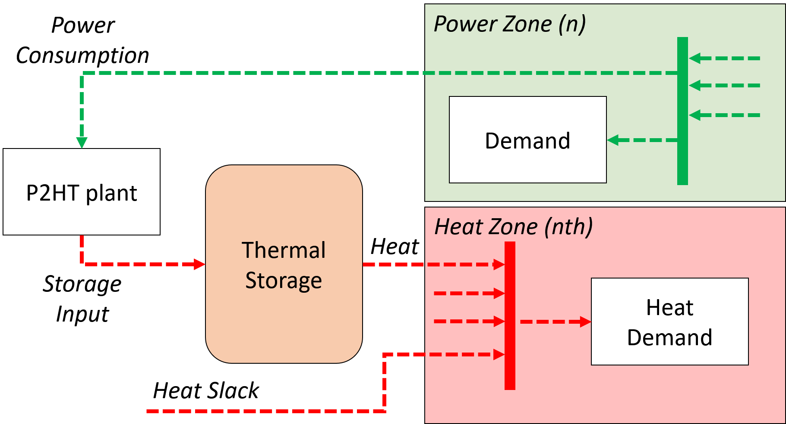
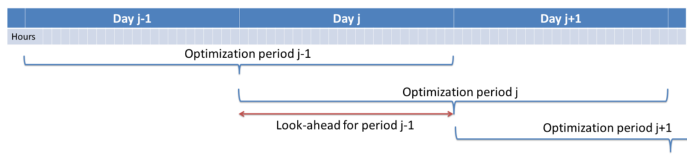

.. _model:

Model Description
=================

The model is expressed as a MILP or LP problem. Continuous variables include the individual unit dispatched power, the shedded load and the curtailed power generation. The binary variables are the commitment status of each unit. The main model features can be summarized as follows:

Variables
^^^^^^^^^

Sets
----

.. table:: 

	======= =================================================================================
	Name	Description
	======= =================================================================================
	au		All units
	u(au)   Generation units
	chp(u)  CHP units
	p2x(au) Power-to-X units (convert electricity to another energy carrier)
	x2p(au) X-to-Power units (convert energy from a boundary sector to electricity)
	xu(au)  Boundary-sector-only units (do not appear in the power balance)
	s(au)   Storage units (with reservoir, includes hydro and batteries)
	th(au)  Units with thermal storage
	hu(au)  Heat-only units
	cu(au)  Conventional (synchronous) units
	ba(au)  Battery units
	wat(au) Hydro storage technologies
	res     Reserve types
	res_U(res) Upward reserve types
	res_D(res) Downward reserve types
	f       Fuel types
	h       Hours
	i(h)    Time steps in the current optimization horizon
	i_last(h) Subset containing the last simulated hour of the horizon
	l       Transmission lines between nodes
	l_int(l) Transmission lines between internal zones
	l_RoW(l) Transmission lines to the rest of the world
	lx      Boundary sector lines
	slx     Boundary sector spillage lines
	mk      Market types {DA: Day-Ahead, Flex: flexible demand}
	n       Zones within each country (currently one zone, or node, per country)
	nx      Boundary sector nodes
	p       Pollutants
	t       Power generation technologies
	tr(t)   Renewable power generation technologies
	z(h)	Subset of every simulated hour
	======= =================================================================================

Parameters
----------

.. table::

	======================================= ======= =============================================================
	Name                                    Units   Description
	======================================= ======= =============================================================
	AvailabilityFactor(au,h)                %       Percentage of nominal capacity available
	CHPPowerLossFactor(u)                   %       Power loss when generating heat
	CHPPowerToHeat(u)                       %       Nominal power-to-heat factor
	CHPMaxHeat(chp)                         MW      Maximum heat capacity of chp plant
	CHPType                                 n.a.    CHP Type {Extraction, Back-Pressure, P2H}
	CommittedInitial(au)                    n.a.    Initial commitment status
	CostCurtailment(n,h)                    EUR/MWh Cost of VRES curtailment
	CostFixed(au)                           EUR/h   Fixed costs
	CostFloodControl(au,h)                  EUR/MWh Cost of violating storage flood level
	CostLoadShedding(n,h)                   EUR/MWh Load shedding costs (value of lost load)
	CostOfSpillage(au,h)                    EUR/MWh Cost of spillage from storage reservoirs
	CostRampDown(au)                        EUR/MW  Ramp-down costs
	CostRampUp(au)                          EUR/MW  Ramp-up costs
	CostShutDown(au)                        EUR/u   Shut-down costs for one unit
	CostStartUp(au)                         EUR/u   Start-up costs for one unit
	CostStorageAlert(au,h)                  EUR/MWh Cost of violating storage alert level
	CostVariable(au,h)                      EUR/MWh Variable costs
	CostWaterValue(au,h)                    EUR/MWh Cost of storage level violation at end of horizon
	Curtailment(n)                          n.a.    Curtailment {binary: 1 allowed}
	Demand(mk,n,h)                          MW      Hourly demand in each zone (mk=DA or Flex)
	Droop(au)                               %       Frequency droop of the unit
	Efficiency(au,h)                        %       Power plant efficiency
	EmissionMaximum(n,p)                    tP      Emission limit per zone for pollutant p
	EmissionRate(au,p)                      tP/MWh  Emission rate of pollutant p from unit u
	FlowMaximum(l,h)                        MW      Maximum flow in line
	FlowMinimum(l,h)                        MW      Minimum flow in line
	Fuel(au,f)                              n.a.    Fuel type used by unit u {binary: 1 u uses f}
	InertiaConstant(au)                     s       Inertia constant of the unit
	InertiaDemand(h)                        MWs/h   System-level inertia demand
	LineNode(l,n)                           n.a.    Line-zone incidence matrix {-1,+1}
	LoadMaximum(au,h)                       %       Maximum load given AF and OF
	LoadShedding(n,h)                       MW      Load that may be shed per zone in 1 hour
	Location(au,n)                          n.a.    Location {binary: 1 u located in n}
	LPFormulation                           n.a.    1 for LP formulation, 0 for MIP (MILP)
	MTS                                     n.a.    0: rolling-horizon UC; 1: cyclic MTS; 2: fixed-BC MTS
	Nunits(au)                              n.a.    Number of units inside the cluster
	OFDM_Participation(res)                 n.a.    Fraction of demand available for Optional Downward Flexibility Management
	OutageFactor(au,h)                      %       Outage factor (100 % = full outage) per hour
	PartLoadMin(au)                         %       Minimum part-load as a fraction of installed capacity
	PowerCapacity(au)                       MW/u    Installed capacity per unit
	PowerInitial(au)                        MW/u    Power output before initial period
	PowerMinStable(au)                      MW/u    Minimum stable power output
	PowerMustRun(au,h)                      MW/u    Minimum power output (derived parameter)
	PriceTransmission(l,h)                  EUR/MWh Price of transmission between zones
	PTDF(l_int,n)                           p.u.    Power Transfer Distribution Factor matrix
	RampDownMaximum(au)                     MW/h/u  Ramp down limit
	RampShutDownMaximum(au)                 MW/h/u  Shut-down ramp limit
	RampStartUpMaximum(au)                  MW/h/u  Start-up ramp limit
	RampUpMaximum(au)                       MW/h/u  Ramp up limit
	ReserveDemand(res,n,h)                  MW      Required reserve provision by type, node and hour
	ReserveParticipation(res,au,h)          n.a.    Whether unit au can provide reserve type res {binary}
	StorageAlertLevel(au,h)                 %       Storage level below which alert is triggered (fraction of capacity)
	StorageCapacity(au)                     MWh/u   Storage capacity (reservoirs)
	StorageChargingCapacity(au)             MW/u    Maximum charging capacity
	StorageChargingEfficiency(au)           %       Charging efficiency
	StorageDischargeEfficiency(au)          %       Discharge efficiency
	StorageFloodControl(au,h)               %       Maximum allowed storage level (flood control, fraction of capacity)
	StorageHours(au)                        h       Ratio of storage capacity to discharge capacity
	StorageInflow(au,h)                     MW/u    Storage inflows (e.g. natural water inflows)
	StorageInitial(au)                      MWh     Storage level before initial period
	StorageMinimum(au)                      MWh     Minimum storage level
	StorageOutflow(au,h)                    MW/u    Storage outflows (e.g. water withdrawals)
	StorageProfile(au,h)                    %       Required minimum storage level profile (end of horizon)
	StorageSelfDischarge(au)                %/day   Self-discharge of the storage units
	Technology(au,t)                        n.a.    Technology type {binary: 1: u belongs to t}
	TimeDownMinimum(au)                     h       Minimum down time
	TimeStartUp(au)                         h       Start-up time (relevant for reserve provision eligibility)
	TimeStep                                h       Duration of a time step
	TimeUpMinimum(au)                       h       Minimum up time
	UFLS_Participation(res)                 n.a.    Fraction of demand available for Under Frequency Load Shedding
	VirtualInertia_Participation(au)        n.a.    Fraction of inverter-based unit capacity available for virtual inertia
NB: When the parameter is expressed per unit ("/u"), its value must be provided for one single unit (even in the case of a clustered formulation).

Optimization Variables
----------------------

.. table::

    ====================================== ======= =============================================================
    Name                                   Units   Description
    ====================================== ======= =============================================================
    AccumulatedOverSupply(n,h)             MWh     Accumulated oversupply due to the flexible demand
    Committed(au,h)                        n.a.    Number of committed units at hour h (integer or continuous)
    CostStartUpH(au,h)                     EUR     Cost of starting up
    CostShutDownH(au,h)                    EUR     Cost of shutting down
    CostRampUpH(au,h)                      EUR     Ramp-up cost
    CostRampDownH(au,h)                    EUR     Ramp-down cost
    CurtailedPower(n,h)                    MW      Curtailed power at node n
    CurtailmentReserve(res,n,h)            MW      Curtailed VRES power allocated as reserve at node n
    Flow(l,h)                              MW      Power flow through internal lines
    FlowX(lx,h)                            MW      Power flow through boundary sector lines
    FootRoom(au,h)                         MW      Available downward flexibility headroom
    HeadRoom(au,h)                         MW      Available upward flexibility headroom
    Heat(au,h)                             MW      Heat output by CHP or heat-only plant
    InertiaPowerAllocation(au,h)           MW      Power allocated by inverter-based units for virtual inertia
    LL_FloodControl(au,h)                  MWh     Violation of flood-control storage constraint
    LL_Inertia(h)                          GWs     Deficit in system inertia
    LL_MaxPower(n,h)                       MW      Deficit in terms of maximum power (unsupplied energy)
    LL_MinPower(n,h)                       MW      Power exceeding the demand (overproduction)
    LL_RampUp(au,h)                        MW      Ramp-up slack (deficit in ramp-up capability)
    LL_RampDown(au,h)                      MW      Ramp-down slack (deficit in ramp-down capability)
    LL_Reserve(res,n,h)                    MW      Deficit in reserve type *res* at node n
    LL_StorageAlert(au,h)                  MWh     Violation of storage alert level constraint
    OFDM(res,n,h)                          MW      Optional Downward Flexibility Management activation
    Power(au,h)                            MW      Power output of unit au
    PowerConsumption(p2x,h)                MW      Electrical power consumed by P2X unit
    PowerX(nx,au,h)                        MW      Power output expressed in boundary-sector energy units
    ReserveProvision(res,au,h)             MW      Reserve provision by unit au for reserve type res
    ResidualLoad(n,h)                      MW      Residual load at node n after VRES and RoW flows
    SectorXFlexDemand(nx,h)                MW      Flexible demand in boundary sector nx
    SectorXFlexSupply(nx,h)                MW      Flexible supply in boundary sector nx
    SectorXSpillage(slx,h)                 MW      Spillage through boundary sector spillage line slx
    SectorXStorageInput(nx,h)              MW      Net storage input to boundary sector nx
    SectorXStorageLevel(nx,h)              MWh     Storage level of boundary sector nx
    ShedLoad(n,h)                          MW      Shed (voluntary or involuntary) load at node n
    spillage(au,h)                         MWh     Spillage from water reservoirs
    StorageInput(au,h)                     MW      Charging input for storage units
    StorageLevel(au,h)                     MWh     Storage level of charge
    StorageLevelViolation(au)              MWh     Unsatisfied storage level at end of optimization horizon
    StorageSlack(au,h)                     MWh     Storage level slack at end of simulation time step
    SynchronousInertiaProvision(au,h)      s       Inertia contribution from synchronous (conventional) units
    SystemCost(h)                          EUR     Total system cost in hour h
    UFLS(res,n,h)                          MW      Under Frequency Load Shedding activation
    VirtualInertiaProvision(au,h)          s       Inertia contribution from inverter-based units
    WaterSlack(au)                         MWh     Unsatisfied water level at end of optimization period
    XNotServed(nx,h)                       MW      Boundary sector demand served by slack source
    ====================================== ======= =============================================================

Free Variables
--------------

.. table::

    ========================== ======= =============================================================
    Name                       Units   Description
    ========================== ======= =============================================================
    SystemCostD                EUR     Total system cost for one optimization period
    DemandModulation(n,h)      MW      Difference between the flexible demand and the baseline
    Flow(l,h)                  MW      Power flow through lines (free: can be in either direction)
    PowerX(nx,au,h)            MW      Net power exchange between power and boundary sector
    ResidualLoad(n,h)          MW      Residual load (free because it can be negative)
    ========================== ======= =============================================================

Integer / Binary Variables
--------------------------

.. table::

    ======================= ======= =============================================================
    Name                    Units   Description
    ======================= ======= =============================================================
    Committed(au,h)         n.a.    Number of committed units at hour h (integer, or continuous in LP)
    StartUp(au,h)           n.a.    Number of unit start-ups at hour h (integer, or continuous in LP)
    ShutDown(au,h)          n.a.    Number of unit shut-downs at hour h (integer, or continuous in LP)
    ======================= ======= =============================================================

Optimisation model
^^^^^^^^^^^^^^^^^^

The aim of this model is to represent with a high level of detail the short-term operation of large-scale power systems solving the so-called unit commitment problem. To that aim we consider that the system is managed by a central operator with full information on the technical and economic data of the generation units, the demands in each node, and the transmission network.

The unit commitment problem considered in this report is a simplified instance of the problem faced by the operator in charge of clearing the competitive bids of the participants into a wholesale day-ahead power market. In the present formulation the demand side is an aggregated input for each node, while the transmission network is modelled as a transport problem between the nodes (that is, the problem is network-constrained but the model does not include the calculation of the optimal power flows).

The unit commitment problem consists of two parts: i) scheduling the start-up, operation, and shut down of the available generation units, and ii) allocating (for each period of the simulation horizon of the model) the total power demand among the available generation units in such a way that the overall power system costs is minimized. The first part of the problem, the unit scheduling during several periods of time, requires the use of binary variables in order to represent the start-up and shut down decisions, as well as the consideration of constraints linking the commitment status of the units in different periods. The second part of the problem is the so-called economic dispatch problem, which determines the continuous output of each and every generation unit in the system. Therefore, given all the features of the problem mentioned above, it can be naturally formulated as a mixed-integer linear program (MILP). However, the problem can also be relaxed to a linear program (LP). 

There is a possibility of Mid Term scheduling. It allows to optimize the level of energy in the storage reservoirs over a year and use it as endogeneous input in the optimization of interest. In that case, the equations linked to unit commitment are ignored.   

Since our goal is to model a large European interconnected power system, we have implemented a so-called tight and compact formulation, in order to simultaneously reduce the region where the solver searches for the solution and increase the speed at which the solver carries out that search. Tightness refers to the distance between the relaxed and integer solutions of the MILP and therefore defines the search space to be explored by the solver, while compactness is related to the amount of data to be processed by the solver and thus determines the speed at which the solver searches for the optimum. Usually tightness is increased by adding new constraints, but that also increases the size of the problem (decreases compactness), so both goals contradict each other and a trade-off must be found.

Objective function
------------------

The goal of the unit commitment problem is to minimize the total power system costs (expressed in EUR), which include start-up/shut-down, fixed, variable, ramping, transmission, load shedding, reserve shortage, inertia shortage, storage alert/flood violations, spillage, and curtailment costs.

.. math::
	\begin{split}
	\min & \Big[ \sum_{au,i} CostFixed_{au} \cdot Committed_{au,i} \cdot TimeStep \\
	& + \sum_{au,i} ( CostStartUpH_{au,i} + CostShutDownH_{au,i})   \\
	& + \sum_{au,i} (CostRampUpH_{au,i} + CostRampDownH_{au,i})  \\
	& + \sum_{u,i} CostVariable_{u,i} \cdot Power_{u,i} \cdot TimeStep    \\
	& + \sum_{chp,i} CostVariable_{chp,i} \cdot CHPPowerLossFactor_{chp} \cdot Heat_{chp,i} \cdot TimeStep \\
	& + \sum_{l,i} PriceTransmission_{l,i} \cdot Flow_{l,i} \cdot TimeStep \\
	& + \sum_{n,i} CostLoadShedding_{n,i} \cdot ShedLoad_{n,i} \cdot TimeStep  \\
	& + \sum_{nx,i} CostXNotServed_{nx,i} \cdot XNotServed_{nx,i} \cdot TimeStep \\
	& + VOLL \cdot \sum_{n,i} \left( LL_{MaxPower,n,i} + LL_{MinPower,n,i} \right) \cdot TimeStep \\
	& + 0.9 \cdot VOLL \cdot \sum_{res,n,i} LL_{Reserve,res,n,i} \cdot TimeStep \\
	& + 0.9 \cdot VOLL \cdot \sum_{i} LL_{Inertia,i} \cdot TimeStep \\
	& + 0.9 \cdot \sum_{res,n,i} CostLoadShedding_{n,i} \cdot \left( UFLS_{res,n,i} + OFDM_{res,n,i} \right) \cdot TimeStep \\
	& + 0.7 \cdot VOLL \cdot \sum_{au,i} \left( LL_{RampUp,au,i} + LL_{RampDown,au,i} \right) \cdot TimeStep \\
	& + \sum_{s,i} CostStorageAlert_{s,i} \cdot LL_{StorageAlert,s,i} \cdot TimeStep \\
	& + \sum_{s,i} CostFloodControl_{s,i} \cdot LL_{FloodControl,s,i} \cdot TimeStep \\
	& + \sum_{au,i} CostOfSpillage_{au,i} \cdot spillage_{au,i} \cdot TimeStep \\
	& + \sum_{n,i} CostCurtailment_{n,i} \cdot CurtailedPower_{n,i} \cdot TimeStep \\
	& + VOLL \cdot \sum_{au} WaterSlack_{au} \\
	& + VOLL \cdot \sum_{au} StorageLevelViolation_{au} \Big]
	\end{split}

The costs can be broken down as:

* **Fixed costs**: proportional to the number of committed units.
* **Variable costs**: proportional to the power output of the units.
* **Start-up / Shut-down costs**: incurred when a unit changes commitment status.
* **Ramp-up / Ramp-down costs**: incurred when a unit changes its power output.
* **Transmission costs**: proportional to flows through transmission lines.
* **Load shedding costs**: due to voluntary or involuntary load shedding.
* **Boundary sector not-served costs**: energy that could not be supplied to a boundary sector.
* **Loss-of-load penalties**: applied at 100 % of VOLL for power balance violations, 90 % for reserve and inertia shortfalls, and 70 % for ramping violations. These are last-resort slack variables, expected to be zero in a feasible solution.
* **UFLS / OFDM costs**: emergency frequency services activated as a last resort.
* **Storage alert / flood-control penalties**: applied when reservoir levels breach alert or flood thresholds.
* **Spillage costs**: for spilling water from hydro reservoirs.
* **Curtailment costs**: for curtailing variable renewable generation.
* **Water slack / storage level violation**: penalising unsatisfied end-of-horizon reservoir targets.

For additional cost terms related to boundary sectors (sector coupling), see :ref:`sector_coupling`.

The variable production costs (in EUR/MWh) are determined by fuel and emission prices corrected by the efficiency and the emission rate of the unit:

.. math::
	\begin{align}
	 \mathit{CostVariable}_{au,h}= &\mathit{Markup}_{au,h} + \sum _{n,f}\left(\frac{\mathit{Fuel}_{au,f} \cdot \mathit{FuelPrice}_{n,f,h} \cdot \mathit{Location}_{au,n}}{\mathit{Efficiency}_{au,h}}\right)\\
				      & + \sum _p\left(\mathit{EmissionRate}_{au,p} \cdot \mathit{PermitPrice}_p\right)
	\end{align}

The variable cost includes an additional mark-up parameter that can be used for calibration and validation purposes.

From version 2.3, Dispa-SET uses a 3-integer formulation for the commitment status. The number of start-ups and shut-downs at each time step is computed by:

.. math::

	\mathit{Committed}_{au,i}-\mathit{Committed}_{au,i-1} = \mathit{StartUp}_{au,i} - \mathit{ShutDown}_{au,i}

The start-up and shut-down costs are positive variables, calculated from the number of start-ups/shut-downs at each time step:

.. math::
	\begin{align}
		\mathit{CostStartUpH}_{au,i} &= \mathit{CostStartUp}_{au} \cdot \mathit{StartUp}_{au,i}\\
		\mathit{CostShutDownH}_{au,i} &= \mathit{CostShutDown}_{au} \cdot \mathit{ShutDown}_{au,i}
	\end{align}

Renewable units are forced to be committed when their availability factor is non-zero and no outage is scheduled, and are decommitted otherwise.

Ramping costs are defined as positive variables (i.e. negative costs are not allowed) and are computed with the following equations:

.. math:: 
	\begin{align}
		\mathit{CostRampUp}_{u,i} &\geq \mathit{CostRampUp}_u \cdot \left(\mathit{Power}_{u,i}-\mathit{Power}_{u,i-1}\right)\\
		\mathit{CostRampDown}_{u,i} &\geq \mathit{CostRampDown}_u \cdot (\mathit{Power}_{u,i-1}-\mathit{Power}_{u,i})
	\end{align}

It should be noted that in case of start-up and shut-down, the ramping costs are added to the objective function. Using start-up, shut-down and ramping costs at the same time should therefore be performed with care.

In the current formulation, all other costs (fixed and variable costs, transmission costs, load shedding costs) are considered as exogenous parameters. 

As regards load shedding, the model considers the possibility of voluntary load shedding resulting from contractual arrangements between generators and consumers. Additionally, in order to facilitate tracking and debugging of errors, the model also considers some variables representing the capacity the system is not able to provide when the minimum/maximum power, reserve, or ramping constraints are reached. These lost loads are a very expensive last resort of the system used when there is no other choice available. The different lost loads are assigned very high values (with respect to any other costs). This allows running the simulation without infeasibilities, thus helping to detect the origin of the loss of load. In a normal run of the model, without errors, all these variables are expected to be equal to zero.

Day-ahead energy balance
------------------------

The main constraint to be met is the supply-demand balance, for each period and each zone, in the day-ahead market. According to this restriction, the sum of all the power produced by all units in the node (including X-to-Power units), the power injected from neighbouring nodes (via internal lines and from the rest of the world), load shedding and the lost-load slack variables is equal to the load in that node, plus the power consumed for storage charging, plus flexible-demand modulation and P2X consumption.

.. math::
	\begin{align}
	 \sum _u\left(\mathit{Power}_{u,i} \cdot \mathit{Location}_{u,n}\right)
	 + \sum _{x2p}\left(\mathit{Power}_{x2p,i} \cdot \mathit{Location}_{x2p,n}\right)
	 + \mathit{InjectedPower}_{i,n}
	 + \sum _{l_{RoW}}\left(\mathit{Flow}_{l_{RoW},i} \cdot \mathit{LineNode}_{l_{RoW},n}\right)\\
	 + \mathit{ShedLoad}_{n,i}
	 + \mathit{LL_{MaxPower}}_{n,i}
	 = \mathit{Demand}_{DA,n,i} + \mathit{Demand}_{Flex,n,i}
	 + \mathit{DemandModulation}_{n,i}\\
	 + \sum _s\left(\mathit{StorageInput}_{s,i} \cdot \mathit{Location}_{s,n}\right)
	 + \sum _{p2x}\left(\mathit{PowerConsumption}_{p2x,i} \cdot \mathit{Location}_{p2x,n}\right)
	 + \mathit{LL_{MinPower}}_{n,i}
	\end{align}

where :math:`\mathit{InjectedPower}_{i,n}` represents the net power injected via internal interconnectors when the DC Power Flow formulation is used (see `Network Modeling`_ section).

Reserve constraints
-------------------

Besides the production/demand balance, the reserve requirements for all reserve types must be met at each node and hour. In Dispa-SET the reserve types are indexed by the set ``res``, which is split into upward types (``res_U``) and downward types (``res_D``).  The model supports the following European reserve types by default:

.. table::

    ========= ============================
    Type      Description
    ========= ============================
    FFRU      Fast Frequency Response Up
    FCRU      Frequency Containment Reserve Up
    aFRRU     automatic Frequency Restoration Reserve Up
    mFRRU     manual Frequency Restoration Reserve Up
    FFRD      Fast Frequency Response Down
    FCRD      Frequency Containment Reserve Down
    aFRRD     automatic Frequency Restoration Reserve Down
    ========= ============================

Each reserve type has an associated ``ReserveDuration`` (fraction of an hour) and ``FullActivationTime`` (fraction of an hour). Units can participate in a reserve type if ``ReserveParticipation(res,au,h) = 1``.

The upward reserve capability of a committed unit (excluding batteries) is limited by the margin between current power and the available capacity:

.. math::
	\mathit{ReserveProvision}_{res\_U,au,i} \leq
	\mathit{PowerCapacity}_{au} \cdot \mathit{LoadMaximum}_{au,i} \cdot \mathit{Committed}_{au,i} \cdot \mathit{ReserveParticipation}_{res\_U,au,i}

For batteries, all units (committed or not) can provide upward reserve:

.. math::
	\mathit{ReserveProvision}_{res\_U,ba,i} \leq
	\mathit{PowerCapacity}_{ba} \cdot \mathit{LoadMaximum}_{ba,i} \cdot \mathit{Nunits}_{ba} \cdot \mathit{ReserveParticipation}_{res\_U,ba,i}

Non-committed units with a start-up time shorter than or equal to the full activation time of the reserve type can also provide upward reserve:

.. math::
	\mathit{ReserveProvision}_{res\_U,au,i} \leq
	\mathit{PowerCapacity}_{au} \cdot \mathit{LoadMaximum}_{au,i} \cdot (\mathit{Nunits}_{au} - \mathit{Committed}_{au,i}) \cdot \mathit{ReserveParticipation}_{res\_U,au,i}
	\quad \text{if } \mathit{TimeStartUp}_{au} \leq \mathit{FullActivationTime}_{res\_U}

The downward reserve capability is symmetric; batteries can also provide downward reserve from their charging capacity when not committed.

The upward reserve balance at each node must be satisfied:

.. math::
	\mathit{ReserveDemand}_{res\_U,n,i} \leq
	\sum_{au} \mathit{ReserveProvision}_{res\_U,au,i} \cdot \mathit{Location}_{au,n}
	+ \mathit{UFLS}_{res\_U,n,i}
	+ \mathit{LL_{Reserve}}_{res\_U,n,i}

The downward reserve balance:

.. math::
	\mathit{ReserveDemand}_{res\_D,n,i} \leq
	\sum_{au} \mathit{ReserveProvision}_{res\_D,au,i} \cdot \mathit{Location}_{au,n}
	+ \mathit{OFDM}_{res\_D,n,i}
	+ \mathit{LL_{Reserve}}_{res\_D,n,i}

where ``UFLS`` (Under Frequency Load Shedding) and ``OFDM`` (Optional Downward Flexibility Management) are emergency frequency services, bounded by a fraction of the local demand:

.. math::
	\mathit{UFLS}_{res\_U,n,i} \leq \mathit{UFLS\_Participation}_{res\_U} \cdot (\mathit{Demand}_{DA,n,i} - \mathit{ShedLoad}_{n,i})

.. math::
	\mathit{OFDM}_{res\_D,n,i} \leq \mathit{OFDM\_Participation}_{res\_D} \cdot (\mathit{Demand}_{DA,n,i} - \mathit{ShedLoad}_{n,i})

Cross-service aggregate limits (HeadRoom / FootRoom) ensure that the sum of a unit's output and all its upward reserve provision cannot exceed its available capacity:

.. math::
	\mathit{Power}_{au,i} + \mathit{HeadRoom}_{au,i} \leq
	\mathit{PowerCapacity}_{au} \cdot \mathit{LoadMaximum}_{au,i} \cdot \mathit{Committed}_{au,i}

.. math::
	\mathit{HeadRoom}_{au,i} \geq \mathit{ReserveProvision}_{res\_U,au,i} + \mathit{InertiaPowerAllocation}_{au,i}

And similarly for downward reserve (FootRoom):

.. math::
	\mathit{Power}_{au,i} - \mathit{FootRoom}_{au,i} \geq
	\mathit{PowerCapacity}_{au} \cdot \mathit{PartLoadMin}_{au} \cdot \mathit{Committed}_{au,i}

.. math::
	\mathit{FootRoom}_{au,i} \geq \mathit{ReserveProvision}_{res\_D,au,i}

Reserve Requirements
--------------------

The reserve requirements are defined by the user as ``ReserveDemand(res,n,h)``. In case no input is provided, one of three methods implemented in Dispa-SET can be selected.

The first method is static and based on an empirical formula as a function of the maximum expected daily load:

.. math::

	\mathit{ReserveDemand}_{aFRRU,n,i}=\sqrt{10 \cdot \underset h{\mathit{max}}\left(\mathit{Demand}_{\mathit{DA},n,h}\right) + 150^2}-150

Downward reserves are defined as 50\% of the upward margin.

The second method is dynamic and based on the (3+5)% rule. Reserve requirements are computed as a fraction of the forecasted demand and available wind and solar power:

.. math::

       \begin{align}
       \mathit{ReserveDemand}_{aFRRU,n,h}=0.03 \cdot \mathit{Demand}_{\mathit{DA},n,h}
        + 0.05 \cdot \mathit{AvailableWindPower}_{n,h} + 0.05 \cdot \mathit{AvailableSolarPower}_{n,h}
       \end{align}

The third method is dynamic and probabilistic, accounting for forecast errors of demand, wind, and solar power:

.. math::

        \begin{align}
        \mathit{ReserveDemand}_{aFRRU,n,h}= \sqrt{10 \cdot \mathit{Demand}_{\mathit{DA},n,h} + 150^2}-150
	+ 2.74 \cdot \sqrt{ \sigma_{L,n,h}^2 + \sigma_{W,n,h}^2 + \sigma_{S,n,h}^2}
        \end{align}

where the standard deviations of demand, solar and wind forecast errors are combined assuming a 99.7% confidence level.

System Inertia
--------------

Dispa-SET models system inertia requirements to support frequency stability. Two types of inertia are considered:

1. **Synchronous inertia** provided by conventional (synchronous) units:

   .. math::
      \mathit{SynchronousInertiaProvision}_{cu,i} = \frac{\mathit{PowerCapacity}_{cu} \cdot \mathit{Committed}_{cu,i} \cdot \mathit{InertiaConstant}_{cu}}{1000}

2. **Virtual inertia** provided by inverter-based units (wind, solar, batteries) via fast power electronic control:

   .. math::
      \mathit{VirtualInertiaProvision}_{au,i} = \frac{\mathit{InertiaPowerAllocation}_{au,i} \cdot \mathit{InertiaConstant}_{au}}{1000}

   where :math:`\mathit{InertiaPowerAllocation}_{au,i}` is bounded by a fraction of the available capacity controlled by :math:`\mathit{VirtualInertia\_Participation}_{au}`.

The system inertia balance must be met whenever an inertia demand is specified:

.. math::
   \mathit{InertiaDemand}_i \leq \sum_{au} \left( \mathit{SynchronousInertiaProvision}_{au,i} + \mathit{VirtualInertiaProvision}_{au,i} \right) + \mathit{LL_{Inertia}}_i

A deficit :math:`\mathit{LL_{Inertia}}_i` is penalised at 90% of VOLL in the objective function.

Power output bounds
-------------------

The minimum power output is determined by the must-run or stable generation level of the unit if it is committed:

.. math::
	\mathit{Power}\mathit{MustRun}_{u,i} \cdot \mathit{Committed}_{u,i}  \leq \mathit{Power}_{u,i}

In the particular case of CHP unit (extration type or power-to-heat type), the minimum power is defined for for a heat demand equal to zero. If the unit produces heat, the minimum power must be reduced according to the power loss factor and the previous equation is replaced by:

.. math::

	\mathit{Power}\mathit{MustRun}_{chp,i} \cdot \mathit{Committed}_{chp,i}

	- \mathit{StorageInput}_{chp,i} \cdot \mathit{CHPPowerLossFactor}_u

	 \leq \mathit{Power}_{chp,i}

The power output is limited by the available capacity, if the unit is committed:

.. math::

	\mathit{Power}_{u,i}

	 \leq \mathit{PowerCapacity}_u \cdot \mathit{AvailabilityFactor}_{u,i} \cdot (1-\mathit{OutageFactor}_{u,i}) \cdot \mathit{Committed}_{u,i}

The availability factor is used for renewable technologies to set the maximum time-dependent generation level. It is set to one for the traditional power plants. The outage factor accounts for the share of unavailable power due to planned or unplanned outages.

Ramping Constraints
-------------------
Each unit is characterized by a maximum ramp up and ramp down capability. This is translated into the following inequality for the case of ramping up:

.. math::

	\mathit{Power}_{u,i} - \mathit{Power}_{u,i-1} \leq

	(\mathit{Committed}_{u,i} - \mathit{StartUp}_{u,i}) \cdot \mathit{RampUpMaximum}_{u} \cdot \mathit{TimeStep}

	+ \mathit{StartUp}_{u,i} \cdot \mathit{RampStartUpMaximum}_{u} \cdot \mathit{TimeStep}

	- \mathit{ShutDown}_{u,i} \cdot \mathit{PowerMustRun}_{u,i}

	+ \mathit{LL_{RampUp}}_{u,i}

and for the case of ramping down:

.. math::

	\mathit{Power}_{u,i-1} - \mathit{Power}_{u,i} \leq

	(\mathit{Committed}_{u,i} - \mathit{ShutDown}_{u,i}) \cdot \mathit{RampDownMaximum}_{u} \cdot \mathit{TimeStep}

	+ \mathit{ShutDown}_{u,i} \cdot \mathit{RampShutDownMaximum}_{u} \cdot \mathit{TimeStep}

	- \mathit{StartUp}_{u,i} \cdot \mathit{PowerMustRun}_{u,i}

	+ \mathit{LL_{RampDown}}_{u,i}

Note that this formulation is valid for both the clustered formulation and the binary formulation. In the latter case (there is only one unit u), if the unit remains committed, the inequality simplifies into:

.. math::

	\mathit{Power}_{u,i} - \mathit{Power}_{u,i-1} \leq

	\mathit{RampUpMaximum}_{u} \cdot \mathit{TimeStep} + \mathit{LL_{RampUp}}_{u,i}

If the unit has just been committed, the inequality becomes:

.. math::

	\mathit{Power}_{u,i} - \mathit{Power}_{u,i-1} \leq

	\mathit{RampStartUpMaximum}_{u} \cdot \mathit{TimeStep} + \mathit{LL_{RampUp}}_{u,i}

And if the unit has just been stopped:

.. math::

	\mathit{Power}_{u,i} - \mathit{Power}_{u,i-1} \leq

	- \mathit{PowerMustRun}_{u,i} + \mathit{LL_{RampUp}}_{u,i}

Minimum up and down times
-------------------------

The operation of the generation units is also limited as well by the amount of time the unit has been running or stopped. In order to avoid excessive ageing of the generators, or because of their physical characteristics, once a unit is started up, it cannot be shut down immediately. Reciprocally, if the unit is shut down it may not be started immediately. 

To model this in MILP, the number of startups/shutdowns in the last N hours must be limited, N being the minimum up or down time. For the minimum up time, the number of startups during this period cannot be higher than the number of currently committed units:

.. math::

	\sum _{ii=i-\frac{\mathit{TimeUpMinimum}_u}{\mathit{TimeStep}}}^{i} \mathit{StartUp}_{u,ii} \leq \mathit{Committed}_{u,i}

i.e. the currently committed units are not allowed to have performed multiple on/off cycles between the optimization time minus TimeUpMinimum and the optimization time. The implied number of periods is computed by the ratio of TimeUpMinimum and TimeStep. If TimeUpMinimum is not a multiple of TimeStep, their fraction is rounded upwards. In case of a binary formulation (Nunits=1), if the unit is ON at time i, only one startup is allowed in the last TimeUpMinimum periods. If the unit is OFF at time i, no startup is allowed.

A similar inequality can be written for the ninimum down time:

.. math::

	\sum _{ii=i-\frac{\mathit{TimeDownMinimum}_u}{\mathit{TimeStep}}}^{i} \mathit{ShutDown}_{u,ii} \leq \mathit{Nunits}_u - \mathit{Committed}_{u,i}

Storage-related constraints
---------------------------

Generation units with energy storage capabilities (large hydro reservoirs, pumped hydro storage units, hydrogen storage units or batteries) must meet additional restrictions related to the amount of energy stored. Storage units are considered to be subject to the same constraints as non-storage power plants. In addition to those constraints, storage-specific restrictions are added for the set of storage units (i.e. a subset of all units). These restrictions include the storage capacity, inflow, outflow, charging, charging capacity, charge/discharge efficiencies, etc. Discharging is considered as the standard operation mode and is therefore linked to the Power variable, common to all units.

The first constraint imposes that the energy stored by a given unit is bounded by a minimum value:

.. math::

	\mathit{StorageMinimum}_s \leq \mathit{StorageLevel}_{s,i} \cdot \mathit{Nunits}_s

In the case of a storage unit, the availability factor applies to the charging/discharging power, but also to the storage capacity. The storage level is thus limited by:

.. math::

	\mathit{StorageLevel}_{s,i} \leq \mathit{StorageCapacity}_s \cdot \mathit{AvailabilityFactor}_{s,i} \cdot \mathit{Nunits}_s

The energy added to the storage unit is limited by the charging capacity. Charging is allowed only if the unit is not producing (discharging) at the same time (i.e. if ``Committed``, corresponding to normal/discharging mode, is equal to 0):

.. math::

	\mathit{StorageInput}_{s,i} \leq
	\mathit{StorageChargingCapacity}_s \cdot (\mathit{Nunits}_s - \mathit{Committed}_{s,i})

Discharge is limited by the level of charge of the storage unit. The available energy must cover the power output (adjusted for discharge efficiency), reserve provision (adjusted for duration and efficiency), virtual inertia allocation (for batteries), and the outflow from the reservoir:

.. math::

	\frac{\mathit{Power}_{s,i} \cdot \mathit{TimeStep}}{\mathit{StorageDischargeEfficiency}_s}
	+ \sum_{res\_U} \frac{\mathit{ReserveProvision}_{res\_U,s,i} \cdot \mathit{ReserveDuration}_{res\_U}}{\mathit{StorageDischargeEfficiency}_s}
	\leq
	\mathit{StorageInitial}_s \text{ (if } i=1\text{) or } \mathit{StorageLevel}_{s,i-1}
	+ \mathit{StorageInflow}_{s,i} \cdot \mathit{Nunits}_s \cdot \mathit{TimeStep}

Charging is limited by the remaining available storage capacity:

.. math::

	\mathit{StorageInput}_{s,i} \cdot \mathit{StorageChargingEfficiency}_s \cdot \mathit{TimeStep}
	+ \sum_{res\_D} \mathit{ReserveProvision}_{res\_D,s,i} \cdot \mathit{ReserveDuration}_{res\_D} \cdot \mathit{StorageChargingEfficiency}_s\\
	\leq \mathit{Nunits}_s \cdot \mathit{StorageCapacity}_s \cdot \mathit{AvailabilityFactor}_{s,i}
	- \mathit{StorageLevel}_{s,i-1}
	+ \mathit{StorageOutflow}_{s,i} \cdot \mathit{Nunits}_s \cdot \mathit{TimeStep}

The energy balance at each time step is:

.. math::

	\mathit{StorageLevel}_{s,i-1}
	+ \mathit{StorageInflow}_{s,i} \cdot \mathit{Nunits}_s \cdot \mathit{TimeStep}
	+ \mathit{StorageInput}_{s,i} \cdot \mathit{StorageChargingEfficiency}_s \cdot \mathit{TimeStep}
	= \mathit{StorageLevel}_{s,i}
	+ \mathit{StorageOutflow}_{s,i} \cdot \mathit{Nunits}_s \cdot \mathit{TimeStep}
	+ \mathit{spillage}_{s,i}
	+ \frac{\mathit{Power}_{s,i} \cdot \mathit{TimeStep}}{\mathit{StorageDischargeEfficiency}_s}
	+ \mathit{StorageSelfDischarge}_s \cdot \mathit{StorageLevel}_{s,i} \cdot \mathit{TimeStep}

Note that ``StorageInflow`` and ``StorageOutflow`` are defined per unit and must be multiplied by ``Nunits``. ``StorageLevel``, ``spillage``, and ``Power`` are defined for all units. ``StorageSelfDischarge`` accounts for self-discharge losses (expressed in %/day).

In addition, storage alert and flood-control constraints bound the storage level to an acceptable operating range:

.. math::

	\mathit{StorageCapacity}_s \cdot \mathit{Nunits}_s \cdot \min(\mathit{StorageAlertLevel}_{s,i}, \mathit{AvailabilityFactor}_{s,i})
	\leq \mathit{StorageLevel}_{s,i} + \mathit{LL_{StorageAlert}}_{s,i}

.. math::

	\mathit{StorageCapacity}_s \cdot \mathit{Nunits}_s \cdot \mathit{StorageFloodControl}_{s,i}
	+ \mathit{LL_{FloodControl}}_{s,i} \geq \mathit{StorageLevel}_{s,i}

Some storage units are equipped with large reservoirs. A minimum storage level constraint is enforced at the end of each optimization horizon:

.. math::

	\mathit{StorageLevel}_{s,N} \geq \mathit{StorageFinalMin}_{s} - \mathit{StorageLevelViolation}_{s} - \mathit{WaterSlack}_{s}

where :math:`\mathit{StorageFinalMin}` is derived from the ``StorageProfile`` input, and ``WaterSlack`` is a costly slack variable to avoid infeasibility.

Heat balance
------------

In Dispa-SET, CHP plants and heat-only units can satisfy heat demand. Heat can also be covered by a slack source (``XNotServed``). For sector-coupled models, heat delivered to a boundary sector node is modelled via the boundary-sector equations (see :ref:`sector_coupling`).

For heat-only units (``hu``), the heat output is bounded by the available capacity:

.. math::

	\mathit{Heat}_{hu,i} \leq \mathit{PowerCapacity}_{hu} \cdot \mathit{AvailabilityFactor}_{hu,i} \cdot (1-\mathit{OutageFactor}_{hu,i})

Heat production constraints (CHP plants only)
---------------------------------------------

In DispaSET Power plants can be indicated as CHP which gives them the possibility to satisfy heat demand.

The following heat balance constraints are used for any CHP and P2H plant types.

.. math::

    StorageInput_{chp,i} \leq CHPMaxHeat_{chp} \cdot \mathit{Nunits}_{chp} 

The constraints between heat and power production differ for each plant design and are explained within the following subsections.

Steam plants with Backpressure turbine
~~~~~~~~~~~~~~~~~~~~~~~~~~~~~~~~~~~~~~
This options includes steam-turbine based power plants with a backpressure turbine. The feasible operating region is between AB. The slope of the line is the heat to power ratio.

.. math::

    Power_{chp,i}
    =
    StorageInput_{chp,i} \cdot CHPPowerToHeat_{chp}

Steam plants with Extraction/condensing turbine
~~~~~~~~~~~~~~~~~~~~~~~~~~~~~~~~~~~~~~~~~~~~~~~
This options includes steam-turbine based power plants with an extraction/condensing turbine. The feasible operating region is within ABCDE.
The vertical dotted line BC corresponds to the minimum condensation line (as defined by *CHPMaxHeat*). The slope of the DC line is the heat to power ratio and the slope of the AB line is the inverse of the power penalty ratio.

.. math::
    Power_{chp,i}
    \geq
    StorageInput_{chp,i} \cdot CHPPowerToHeat_{chp}

.. math::
    Power_{chp,i}
    \leq
    PowerCapacity_{chp} \cdot \mathit{Nunits} -

    StorageInput_{chp,i} \cdot CHPPowerLossFactor_{chp}

.. math::
    Power_{chp,i}
    \geq
    PowerMustRun_{chp,i} - StorageInput_{chp,i} \cdot CHPPowerLossFactor_{chp}

Power plant coupled with any power to heat option
~~~~~~~~~~~~~~~~~~~~~~~~~~~~~~~~~~~~~~~~~~~~~~~~~

This option includes power plants coupled with resistance heater or heat pumps. The feasible operating region is between ABCD. The slope of the AB and CD line is the inverse of the COP or efficiency.
The vertical dotted line corresponds to the heat pump (or resistance heater) thermal capacity (as defined by *CHPMaxHeat*)

.. math::

    Power_{chp,i}
    \leq
    PowerCapacity_{chp} - StorageInput_{chp,i} \cdot CHPPowerLossFactor_{chp}

.. math::
    Power_{chp,i}
    \geq
    PowerMustRun_{chp,i} - StorageInput_{chp,i} \cdot CHPPowerLossFactor_{chp}

Power to heat units (labeled as P2HT technology)
~~~~~~~~~~~~~~~~~~~~~~~~~~~~~~~~~~~~~~~~~~~~~~~~

Oposite to power plants coupled with any power to heat option, individual power to heat units (technology = P2HT) have only one mode of operation. They consume power to generate heat. In Dispa-SET these units are 
either small scale residential heat pumps or electric heaters or large industrial or district heating devices power by electricity. A shematic overview of these units is shown below:  

They are subjet to the following set of constraints:

.. math::

   StorageInput_{p2h,i} = PowerConsumption_{p2h,i} \cdot Efficiency_{p2h,i}
   
.. math::

   PowerConsumption_{p2h,i} \leq PowerCapacity_{p2h} \cdot Nunits_{p2h}

Heat Storage
~~~~~~~~~~~~
Heat storage is modeled in a similar way as electric storage as follows:

Heat Storage balance:

.. math::

    StorageLevel_{th,i-1}
    +StorageInput_{th,i} \cdot TimeStep
    =

    StorageLevel_{th,i}
    +Heat_{th,i} \cdot TimeStep

	+ StorageSelfDischarge_{th} \cdot StorageLevel_{th,i}\cdot TimeStep/24

Storage level must be above a minimum and below storage capacity:

.. math::

    StorageMinimum_{th} \cdot Nunits_{th}
    \leq
    StorageLevel_{chp,i}
    \leq
    StorageCapacity_{th} \cdot \mathit{Nunits}_{th}

Emission limits
---------------

The operating schedule also needs to take into account any cap on the emissions (not only CO2) from the generation units existing in each node:

.. math::

	\sum _u\left(\mathit{Power}_{u,i} \cdot \mathit{EmisionRate}_{u,p} \cdot TimeStep \cdot \mathit{Location}_{u,n}\right)

	\leq \mathit{EmisionMaximum}_{n,p}

It is important to note that the emission cap is applied to each optimisation horizon: if a rolling horizon of one day is adopted for the simulation, the cap will be applied to all days instead of the whole year.

Network-related constraints
---------------------------

The flow of power between nodes is limited by the capacities of the transmission lines:

.. math::

	\mathit{FlowMinimum}_{l,i} \leq \mathit{Flow}_{l,i} \leq \mathit{FlowMaximum}_{l,i}

Dispa-SET offers two network modelling approaches (see `Network Modeling: NTC and DC-Power Flow`_ section below for details).

Load shedding
-------------

If load shedding is allowed in a node, the amount of shed load is limited by the shedding capacity contracted at that node (e.g. through interruptible industrial contracts):

.. math::

	\mathit{ShedLoad}_{n,i} \leq \mathit{LoadShedding}_{n,i}

Linear Program (LP) optimization
^^^^^^^^^^^^^^^^^^^^^^^^^^^^^^^^
A possible simplification of the model is to run it as a LP instead of MILP. In that case, the LPFormulation parameter needs to be set to 1 (and to 0 otherwise). 

In that case, the commitment status variables Commited, StartUp and ShutDown are not defined as binary and Commited is set smaller than 1. The equations describing the cost of starting up and shutting down are ignored, as well as the ones enforcing minimum up and down times.   	

Mid Term Scheduling (MTS)
^^^^^^^^^^^^^^^^^^^^^^^^^
As will be explained in more detail below, MTS allows the pre-definition of storage levels during the whole year based on simplified equations.

Model in MTS mode
-----------------
When MTS is activated, some equations are dropped/modified. MTS mode is activated by setting the ``MTS`` parameter to 1. In this configuration, all equations concerning unit commitment are deactivated and the integer variables ``Committed``, ``StartUp``, and ``ShutDown`` are not defined. The following constraints are therefore ignored:

* The commitment equations
* The minimum up and down time equations
* The ramp-up and ramp-down limitation equations

Also, due to the absence of the variable ``Committed``, the power availability equation is simplified to:

.. math::
	\mathit{Power}_{u,i} \leq \mathit{PowerCapacity}_u \cdot \mathit{AvailabilityFactor}_{u,i} \cdot (1-\mathit{OutageFactor}_{u,i})

and the maximum charging capacity becomes:

.. math::
	\mathit{StorageInput}_{s,i} \leq \mathit{StorageChargingCapacity}_s \cdot \mathit{Nunits}_s

When MTS is run with cyclic boundary conditions (``MTS = 1``), the initial storage level at the start of each rolling horizon is taken from the last storage level of the previous period, rather than from the ``StorageInitial`` parameter. The minimum end-of-horizon storage level is set to zero, allowing the system to freely distribute storage across the year.

Rolling Horizon
^^^^^^^^^^^^^^^
The mathematical problem described in the previous sections could in principle be solved for a whole year split into time steps, but with all likelihood the problem would become extremely demanding in computational terms when attempting to solve the model with a realistically sized dataset. Therefore, the problem is split into smaller optimization problems that are run recursively throughout the year. 

The following figure shows an example of such approach, in which the optimization horizon is two days, including a look-ahead (or overlap) period of one day. The initial values of the optimization for day j are the final values of the optimization of the previous day. The look-ahead period is modelled to avoid issues related to the end of the optimization period such as emptying the hydro reservoirs, or starting low-cost but non-flexible power plants. In this case, the optimization is performed over 48 hours, but only the first 24 hours are conserved.

The optimization horizon and overlap period can be adjusted by the user in the Dispa-SET configuration file. As a rule of thumb, the optimization horizon plus the overlap period should at least be twice the maximum duration of the time-dependent constraints (e.g. the minimum up and down times). In terms of computational efficiency, small power systems can be simulated with longer optimization horizons, while larger systems should reduce this horizon, the minimum being one day.

In Dispa-SET, the network can be modeled using two different approaches:

Network Modeling: NTC and DC-Power Flow
^^^^^^^^^^^^^^^^^^^^^^^^^^^^^^^^^^^^^^^

Dispa-SET offers two approaches to model power transmission between zones:

1. **Net Transfer Capacity (NTC)** approach: A simple model where the flow of power between nodes is limited by the transmission line capacities without considering the physical characteristics of the lines.

2. **DC-Power Flow** approach: A more detailed physical model using Power Transfer Distribution Factors (PTDF) matrices.

When the DC-Power Flow approach is selected, the flow constraints are modified to account for the physical characteristics of the network. The PTDF matrix calculation follows these main steps:

**1. Electrical Parameter Matrices**

The primitive susceptance matrix :math:`\mathbf{B_p}` is constructed as a diagonal matrix using the reactance values of each line:

.. math::
    \mathbf{B_p} = \text{diag}\left(\frac{1}{j \cdot \text{feeder['X']}}\right)

**2. Node-Branch Incidence Matrix**

The node-branch incidence matrix :math:`\mathbf{A}` represents the connections between nodes and branches:

.. math::
    A_{m,\text{line}} = 
    \begin{cases}
        1 & \text{if node $m$ is the sending end of line} \\
        -1 & \text{if node $m$ is the receiving end of line} \\
        0 & \text{otherwise}
    \end{cases}

**3. Bus Admittance Matrix**

The bus admittance matrix is calculated as:

.. math::
    \mathbf{B_{bus}} = \mathbf{A} \cdot \mathbf{B_p} \cdot \mathbf{A}^T

**4. Slack Bus Handling**

A slack bus is automatically selected (usually the node with the most connections) and the bus admittance matrix is modified accordingly.

**5. PTDF Matrix Calculation**

The branch-to-node PTDF matrix is calculated as:

.. math::
    \mathbf{PTDF} = |\mathbf{B_d}| \cdot \mathbf{A}^T \cdot |\mathbf{B_{bus}}^{-1}|

where :math:`\mathbf{B_d} = |\mathbf{B_p}|` is the absolute value of the primitive susceptance matrix.

The resulting PTDF matrix represents how power injections at each node affect flows on each transmission line. When using the DC-Power Flow model, the power flow limits are applied based on these calculated physical flows instead of the simple NTC-based approach.

References
^^^^^^^^^^
.. [1] Quoilin, S., Hidalgo Gonzalez, I., & Zucker, A. (2017). Modelling Future EU Power Systems Under High Shares of Renewables: The Dispa-SET 2.1 open-source model. Publications Office of the European Union. 
.. [2] Quoilin, S., Nijs, W., Hidalgo, I., & Thiel, C. (2015). Evaluation of simplified flexibility evaluation tools using a unit commitment model. IEEE Digital Library. 
.. [3] Quoilin, S., Gonzalez Vazquez, I., Zucker, A., & Thiel, C. (2014). Available technical flexibility for balancing variable renewable energy sources: case study in Belgium. Proceedings of the 9th Conference on Sustainable Development of Energy, Water and Environment Systems. 

