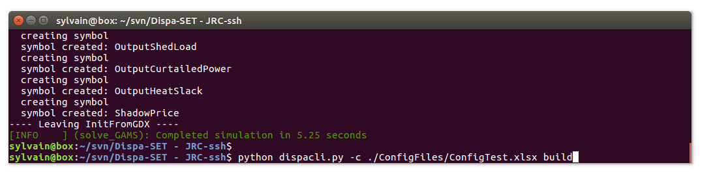
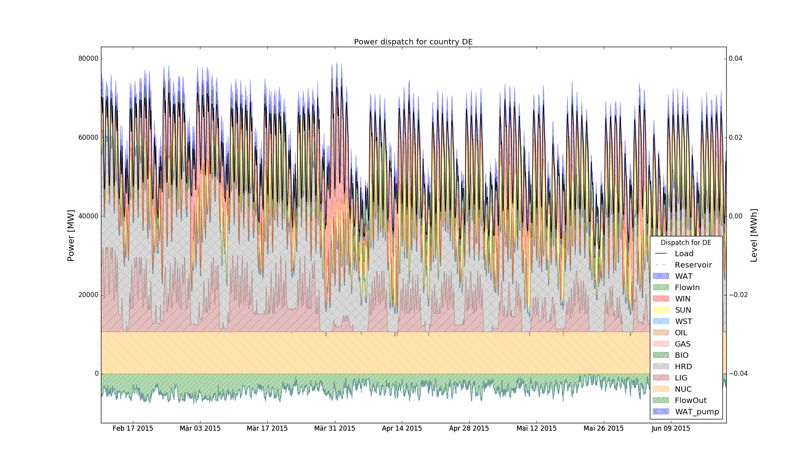
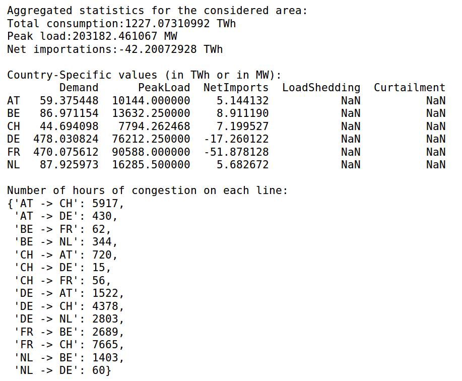
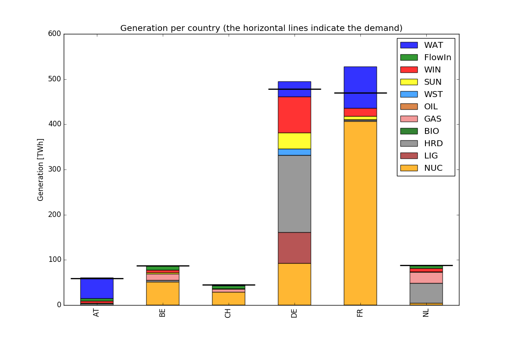

.. _workflow:

Getting Started
===============
This short tutorial describes the main steps to get a practical example of Dispa-SET running.

Prerequisites
-------------
Install Python 2.7, with full scientific stack. The Anaconda_ distribution is recommended since it comprises all the required packages. If Anaconda is not used, the following libraries and their dependencies should be installed manually: 

* numpy
* pandas (> v0.18.1)
* matplotlib 
* xlrd
* pickle

This can be achieved using the pip installer (example for numpy)::

	pip install numpy

NB: For Windows users, some packages might require the installation of a C++ compiler for Python. This corresponds to the typical error message: "Unable to find vcvarsall.bat". This can be solved by installing the freely available "Microsoft Visual C++ Compiler for Python 2.7 ".  In some cases the path to the compiler must be added to the PATH windows environment variable (e.g. C:\Program Files\Common Files\Microsoft\Visual C++ for Python\9.0)

Using Dispa-SET with GAMS:
^^^^^^^^^^^^^^^^^^^^^^^^^^
Dispa-SET is primarily designed to run with GAMS and therefore requires GAMS to be installed with a valid user licence. Currently, only the 64-bit version of GAMS is supported in Dispa-SET!

The GAMS api for python has been pre-compiled in the "Externals" folder and is usable with most operating systems. If the pre-compiled binaries are not available or could not be loaded, the system exits with an error message. In that case, the gams python api should be compiled from the source provided in the GAMS installation folder (e.g. "C:\\GAMS\\win64\\24.3\\apifiles\\Python\\api")::

	python gdxsetup.py install
	python gamssetup.py install

The api requires the path to the gams installation folder. The "get_gams_path()" function of dispa-set performs a system search to automatically detect this path. It case it is not successful, the user is prompted for the proper installation path. 

Using Dispa-SET with PYOMO:
^^^^^^^^^^^^^^^^^^^^^^^^^^^

* Install pyomo ::

	pip install pyomo
* Install a solver and add it to the PATH environment variable (e.g. if cplex is installed, the "cplex" command should be callable from any command prompt).

.. warning::
    The PYOMO version of Dispa-SET is currently outdated. The changes implemented in Dispa-SET version 2.2 and 2.3 will not work in the Pyomo solver. It is recommended using the GAMS solver to benefit from the latest improvements of the model.

Step-by-step example of a Dispa-SET run
---------------------------------------
This section describes the pre-processing and the solving phases of a Dispa-SET run. Three equivalent methods are described in the next sections:

* Using the command line interface

* Using the Dispa-SET API

* Using GAMS

1. Using the command line interface
^^^^^^^^^^^^^^^^^^^^^^^^^^^^^^^^^^^

Dispa-SET can be run from the command line. To that aim, open a terminal window and change de directory to the Dispa-SET root folder. 

1.1. Check the configuration file
"""""""""""""""""""""""""""""""""
Dispa-SET runs are defined in dedicated excel configuration files stored in the "ConfigFiles" folder. The configuration file "ConfigTest.xlsx" is provided for testing purposes. It generates a 10-days optimisation using data relative a fictitious power system composed of two zones Z1 and Z2. 

1.2. Pre-processing
"""""""""""""""""""
From the command line, specify the configuration file to be used as an argument, the solver (Pyomo or GAMS) and the actions to be performed. Within the "Dispa-SET" folder, run::

	python dispacli.py -c ./ConfigFiles/ConfigTest.xlsx build

NB: The command line interface dispacli.py is designed to run with the Python interpreter, which should be the one selected. It might present some problems when run in Ipython.

1.3. Check the simulation environment
"""""""""""""""""""""""""""""""""""""
The simulation environment folder is defined in the configuration file. In the test example it is set to "Simulations/simulation_test". The simulation inputs are written in three different formats: excel (34 excel files), Python (Inputs.p) and GAMS (Inputs.gdx). 

1.4. Run the optimisation
"""""""""""""""""""""""""
Using the GAMS api, the simulation can be started directly from the main DispaSet python file after the pre-processing phase. From the "Dispa-SET" folder, run::

	python dispacli.py -g -c ./ConfigFiles/ConfigTest.xlsx simulate

This generates the simulation environment, runs the optimisation, and stores the results in the same folder. Note that this can only work is the simulation has been pre-processed before (step 1.2). It is possible to combine the pre-processing and simulation step in one command::

	python dispacli.py -g -c ./ConfigFiles/ConfigTest.xlsx build simulate	

The same action can be performed using the PYOMO solver. In that case, the "-g" argument must be changed into "-p"::

	python dispacli.py -p -c ./ConfigFiles/ConfigTest.xlsx build simulate

2. Using the Dispa-SET API.
^^^^^^^^^^^^^^^^^^^^^^^^^^^

The steps to run a model can be also performed directly in python, by importing the Dispa-SET library. An example file ("build_and_run.py") is available in the "scripts/" folder.
After checking the configuration file "ConfigTest.xlsx" (in the "ConfigFiles" folder). Run the following python commands: 

2.1 Import Dispa-SET::

	import DispaSET as ds

2.2 Load the configuration file::
	
	config = ds.load_config_excel('ConfigFiles/ConfigTest.xlsx')

2.3 Build the simulation environment (Folder that contains the input data and the simulation files required for the solver)::

	SimData = ds.build_simulation(config)

2.4a Solve using PYOMO::

	r = ds.solve_pyomo(config['SimulationDirectory'])

2.4b Solve using GAMS::

	r = ds.solve_GAMS(config['SimulationDirectory'], config['GAMS_folder'])

A more detailed description of the Dispa-SET functions in available in the API section.

3. Using GAMS
^^^^^^^^^^^^^

It is sometimes useful to run the dispa-SET directly in GAMS (e.g. for debugging purposes). In that case, the pre-processing must be run first (steps 1.2 or 2.1, 2.2 and 2.3) and the gams file generated in the simulation folder can be used to run the optimization. 

Using the GAMS graphical user interface:
""""""""""""""""""""""""""""""""""""""""
From the simulation folder (defined in the config file), the Dispa-SET model can be run following the instruction below: 

1. Open the UCM.gpr project file in GAMS
2. From GAMS, open the UCM_h.gmx model file
3. Run the model in GAMS.

The result file is written in the gdx format and stored in the Simulation folder, together with all input files.

Using the GAMS command line:
""""""""""""""""""""""""""""
GAMS can also be run from the command line (this is the only option for the Linux version).

1. Make sure that the gams binary is in the system PATH
2. From the simulation environment folder, run::

	gams UCM_h.gms

Postprocessing
--------------
Various functions and tools are provided within the PostProcessing.py file to load, analyse and plot the siimulation results. The use of these functions is illustrated into the the "Read_results_notebook.ipynb"  Notebook or in the "read_results.py" script, which can be run by changing the path to the simulation folder. The type of results provided by the post-processing is illustrated hereunder.

The power dispatch can be plotted for each simulated zone. In this plot, the units are aggregated by fuel type. The power consumed by storage units and the exportations are indicated as negative values. 

It is also interesting to display the results at the unit level to gain deeper insights regarding the dispatch. In that case, a plot is generated, showing the commitment status of all units in a zone at each timestep. Both the dispatch plot and the commitment plot can be called using the CountryPlots function. 

.. image:: figures/results_rug.png

Some aggregated statistics on the simulations results can also be obtained, including the number of hours of congestion in each interconnection line, the yearly energy balances for each zone, the amount of lost load, etc.

The yearly energy balance per fuel or per technology is also useful to compare the energy mix in each zone. This can be plotted using the EnergyBarPlot function, with the following results:

.. _Anaconda: https://www.continuum.io/downloads
